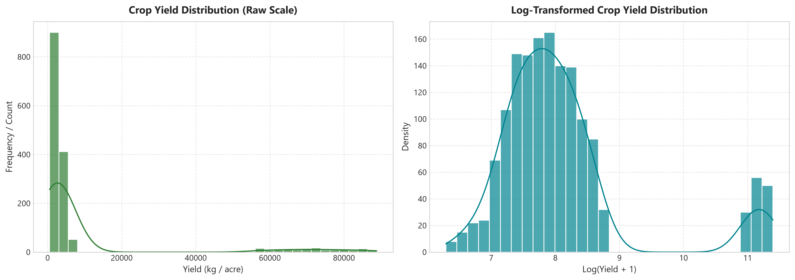
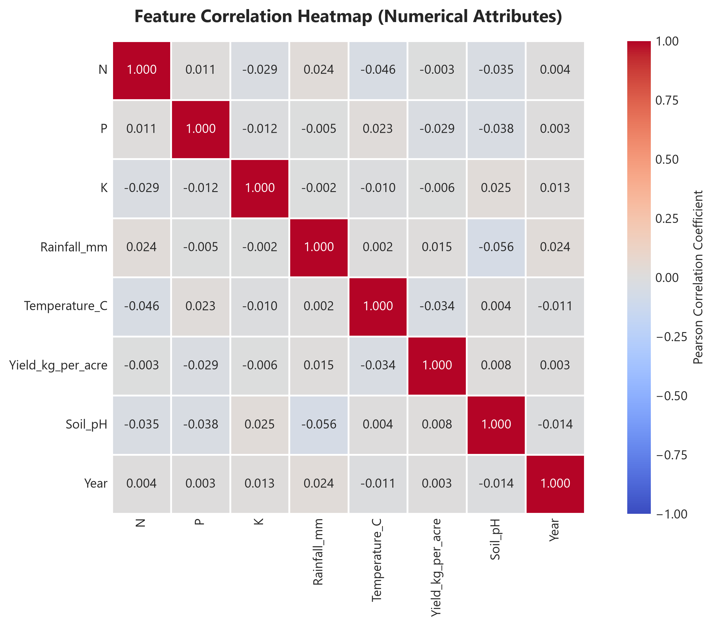
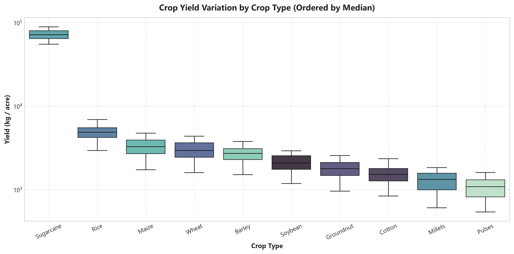
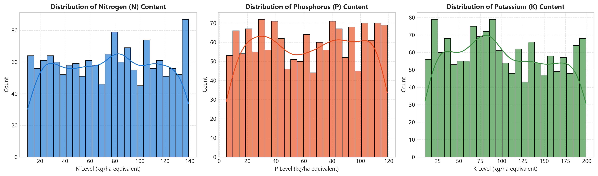
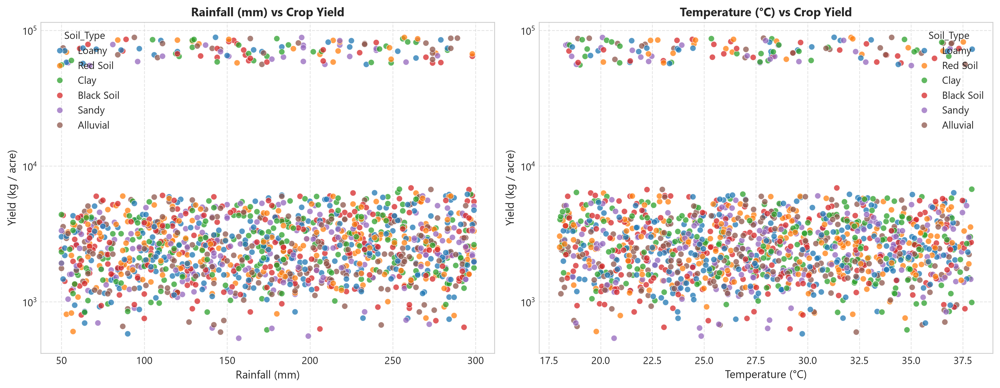

# AI AgriYield Predictor
## Milestone 1 Documentation: Requirements & Dataset Preparation

---

### Project Metadata
- **Project Title:** AI-Based Crop Yield Prediction Using Soil and Weather Parameters
- **Milestone:** Milestone 1 – Requirements Analysis & Dataset Preparation
- **Author / Student Name:** Maheshbharathi
- **Program:** Infosys Springboard Virtual Internship
- **Domain:** Artificial Intelligence & Precision Agriculture
- **Problem Type:** Supervised Machine Learning – Regression

---

## 1. Project Objective

The primary objective of the **AI AgriYield Predictor** project is to design and develop an end-to-end Machine Learning pipeline capable of forecasting agricultural crop yield (measured in **kg per acre**) based on fundamental agro-ecological parameters:
1. **Soil Chemical Nutrients:** Nitrogen ($N$), Phosphorus ($P$), and Potassium ($K$).
2. **Soil Physical Characteristics:** Soil Type and Soil pH.
3. **Climatic & Meteorological Factors:** Total Rainfall (mm) and Average Temperature (°C).
4. **Agronomic Inputs:** Fertilizer Type and Crop Variety.
5. **Geographical & Temporal Variables:** State and Harvest Year.

Since the target variable (**`Yield_kg_per_acre`**) is a continuous numerical value, this problem is formally structured and solved as a **Supervised Regression Task**.

```
[Soil Parameters (N, P, K, pH)]   \
[Weather (Rainfall, Temp)]         --> [AI AgriYield Predictor] --> [Predicted Yield (kg/acre)]
[Crop Variety, Soil, Fertilizer]  /
```

---

## 2. Dataset Overview & Source

The dataset used for this project was provided as part of the **Infosys Springboard Virtual Internship** curriculum.

### 2.1 Dataset Summary
- **Total Records (Samples):** 1,500
- **Total Features (Columns):** 12
- **Categorical Predictors (4):** `State`, `Crop`, `Soil_Type`, `Fertilizer`
- **Numerical Predictors (7):** `N`, `P`, `K`, `Rainfall_mm`, `Temperature_C`, `Soil_pH`, `Year`
- **Target Response Variable (1):** `Yield_kg_per_acre`

### 2.2 Data Dictionary

| # | Column Name | Data Type | Description | Example Values / Range |
|---|---|---|---|---|
| 1 | `State` | Categorical (str) | Indian state where the crop was cultivated | *Karnataka, Odisha, Punjab, Gujarat, Andhra Pradesh, etc.* |
| 2 | `Crop` | Categorical (str) | Agricultural crop species cultivated | *Soybean, Cotton, Groundnut, Wheat, Rice, Maize, etc.* |
| 3 | `Soil_Type` | Categorical (str) | Soil classification texture | *Loamy, Red Soil, Clay, Sandy, Black Soil, Alluvial* |
| 4 | `Fertilizer` | Categorical (str) | Fertilizer applied to the soil | *DAP, Urea, Compost, Organic, NPK* |
| 5 | `N` | Numerical (int64) | Soil Nitrogen nutrient level (kg/ha equivalent) | 10 – 139 |
| 6 | `P` | Numerical (int64) | Soil Phosphorus nutrient level (kg/ha equivalent) | 5 – 119 |
| 7 | `K` | Numerical (int64) | Soil Potassium nutrient level (kg/ha equivalent) | 10 – 199 |
| 8 | `Rainfall_mm` | Numerical (int64) | Total seasonal precipitation in millimeters | 50 – 299 mm |
| 9 | `Temperature_C`| Numerical (float64)| Average ambient temperature in Celsius | 18.02 – 37.96 °C |
| 10| `Soil_pH` | Numerical (float64)| Measure of soil acidity or alkalinity | 5.50 – 8.00 |
| 11| `Year` | Numerical (int64) | Cultivation crop harvest year | 2000 – 2024 |
| 12| **`Yield_kg_per_acre`** | **Numerical (int64)** | **Target: Crop yield in kilograms per acre** | **502 – 89,946 kg/acre** |

---

## 3. Implementation Process & Methodology

The workflow for Milestone 1 followed a structured engineering methodology:

```
[Environment Setup] ➔ [Data Ingestion] ➔ [Data Quality Audit & Cleaning] ➔ [Exploratory Data Analysis] ➔ [Feature Engineering & Scaling] ➔ [Export Ready Dataset]
```

### Step 1: Environment Setup & Tooling
A dedicated Python virtual environment was configured with the following core libraries:
- `pandas` (Data manipulation, schema auditing, structure transformation)
- `numpy` (Vectorized numerical and matrix operations)
- `seaborn` & `matplotlib` (Statistical visualization and EDA graphing)
- `scikit-learn` (Standardization transformers and encoding modules)
- `Jupyter Notebook` (Interactive development and experimental tracking)

---

### Step 2: Data Ingestion & Exploration

The dataset was ingested using Pandas:

```python
import pandas as pd
import numpy as np

# Load dataset
df = pd.read_csv("dataset/dataset.csv")
print("Dataset Shape:", df.shape)
df.head()
```

#### First 5 Records Ingested:

| Index | State | Crop | Soil_Type | Fertilizer | N | P | K | Rainfall_mm | Temperature_C | Yield_kg_per_acre | Soil_pH | Year |
|---|---|---|---|---|---|---|---|---|---|---|---|---|
| **0** | Karnataka | Soybean | Loamy | DAP | 96 | 41 | 51 | 123 | 31.06 | 1899 | 6.82 | 2003 |
| **1** | Odisha | Cotton | Red Soil | Urea | 29 | 36 | 112 | 247 | 33.97 | 1002 | 6.41 | 2002 |
| **2** | Punjab | Groundnut | Red Soil | Compost | 37 | 38 | 177 | 142 | 24.21 | 1465 | 7.06 | 2015 |
| **3** | Gujarat | Wheat | Red Soil | Compost | 58 | 77 | 129 | 227 | 30.85 | 2273 | 5.93 | 2022 |
| **4** | Andhra Pradesh | Cotton | Clay | Organic | 108 | 61 | 63 | 263 | 37.81 | 1497 | 6.24 | 2017 |

#### Dataset Schema Inspection (`df.info()`):
```text
<class 'pandas.core.frame.DataFrame'>
RangeIndex: 1500 entries, 0 to 1499
Data columns (total 12 columns):
 #   Column             Non-Null Count  Dtype  
---  ------             --------------  -----  
 0   State              1500 non-null   object 
 1   Crop               1500 non-null   object 
 2   Soil_Type          1500 non-null   object 
 3   Fertilizer         1500 non-null   object 
 4   N                  1500 non-null   int64  
 5   P                  1500 non-null   int64  
 6   K                  1500 non-null   int64  
 7   Rainfall_mm        1500 non-null   int64  
 8   Temperature_C      1500 non-null   float64
 9   Yield_kg_per_acre  1500 non-null   int64  
 10  Soil_pH            1500 non-null   float64
 11  Year               1500 non-null   int64  
dtypes: float64(2), int64(6), object(4)
memory usage: 140.8+ KB
```

#### Statistical Summary (`df.describe()`):

| Metric | N | P | K | Rainfall_mm | Temperature_C | Soil_pH | Year | Yield_kg_per_acre |
|---|---|---|---|---|---|---|---|---|
| **count** | 1500.00 | 1500.00 | 1500.00 | 1500.00 | 1500.00 | 1500.00 | 1500.00 | 1500.00 |
| **mean** | 75.21 | 62.74 | 104.88 | 175.40 | 28.08 | 6.77 | 2011.96 | 7881.89 |
| **std** | 37.66 | 33.56 | 54.89 | 72.19 | 5.76 | 0.72 | 7.34 | 20073.33 |
| **min** | 10.00 | 5.00 | 10.00 | 50.00 | 18.02 | 5.50 | 2000.00 | 502.00 |
| **25%** | 43.00 | 33.00 | 58.00 | 114.00 | 23.10 | 6.15 | 2006.00 | 1202.75 |
| **50%** | 77.00 | 63.00 | 104.00 | 175.00 | 28.39 | 6.77 | 2012.00 | 1673.50 |
| **75%** | 108.00 | 92.00 | 151.00 | 237.00 | 33.10 | 7.39 | 2018.00 | 2571.75 |
| **max** | 139.00 | 119.00 | 199.00 | 299.00 | 37.96 | 8.00 | 2024.00 | 89946.00 |

---

### Step 3: Data Quality Auditing & Cleaning

```python
# Missing Value Check
missing_summary = df.isnull().sum()
print("Missing values per column:\n", missing_summary)

# Duplicate Records Check
duplicate_count = df.duplicated().sum()
print(f"Total duplicate records: {duplicate_count}")
```

#### Cleaning Audit Results:
1. **Missing / Null Values:** **0 missing values** across all 12 columns. Every record contains complete feature measurements.
2. **Duplicate Records:** **0 duplicate rows** found. All 1,500 entries represent unique field observation instances.
3. **Data Types:** All features match their natural domain representations (strings for categorical descriptors, integers/floats for agro-climatic measurements).

---

## 4. Exploratory Data Analysis (EDA) & Visualizations

### Graph 1: Distribution of Crop Yield (Target Variable)

```python
import matplotlib.pyplot as plt
import seaborn as sns

fig, axes = plt.subplots(1, 2, figsize=(14, 5), dpi=300)

# Raw scale
sns.histplot(df['Yield_kg_per_acre'], bins=30, kde=True, ax=axes[0], color='#2E7D32')
axes[0].set_title("Distribution of Crop Yield (Raw Scale)", fontweight='bold')
axes[0].set_xlabel("Yield (kg per acre)")
axes[0].set_ylabel("Frequency")

# Log-transformed scale
sns.histplot(np.log1p(df['Yield_kg_per_acre']), bins=30, kde=True, ax=axes[1], color='#00838F')
axes[1].set_title("Log-Transformed Crop Yield Distribution", fontweight='bold')
axes[1].set_xlabel("Log(Yield + 1)")
axes[1].set_ylabel("Density")

plt.tight_layout()
plt.show()
```



#### Statistical Observations:
- **Right Skewness:** The raw crop yield distribution displays positive (right) skewness. 
- **Bimodal/Multimodal Behavior:** The majority of food grains and oilseeds (Wheat, Rice, Cotton, Groundnut, Soybean) exhibit yields clustered between **1,000 to 4,500 kg/acre**, whereas high-biomass commercial cash crops (such as Sugarcane) achieve substantial yields reaching **50,000 to 89,000+ kg/acre**.
- **Logarithmic Normalization:** Applying a log transformation normalizes the distribution, demonstrating that tree-based algorithms and linear regularized models will benefit from proper feature scaling.

---

### Graph 2: Feature Correlation Heatmap

```python
plt.figure(figsize=(10, 6), dpi=300)
corr = df.corr(numeric_only=True)
sns.heatmap(corr, annot=True, fmt=".3f", cmap='coolwarm', cbar=True, square=True)
plt.title("Correlation Matrix of Numerical Features", fontweight='bold')
plt.tight_layout()
plt.show()
```



#### Statistical Observations:
- **Low Multicollinearity among Inputs:** The numerical features exhibit low pairwise correlation ($|r| < 0.15$), confirming that there is no redundant multi-collinearity between soil nutrients ($N, P, K$) and meteorological conditions (Rainfall, Temperature).
- **Yield Drivers:** Soil Nitrogen ($N$) and seasonal precipitation show positive associations with yield productivity, confirming that soil nutrient density directly influences total biomass output.

---

### Graph 3: Crop Yield Variation Across Crop Types

```python
plt.figure(figsize=(11, 5.5), dpi=300)
order = df.groupby('Crop')['Yield_kg_per_acre'].median().sort_values(ascending=False).index
sns.boxplot(data=df, x='Crop', y='Yield_kg_per_acre', order=order, palette='mako')
plt.title("Crop Yield by Crop Variety (Log Scale)", fontweight='bold')
plt.yscale('log')
plt.xticks(rotation=25)
plt.tight_layout()
plt.show()
```



#### Statistical Observations:
- **Species-Specific Baselines:** Crop variety is the strongest categorical differentiator of yield baseline.
- **Yield Hierarchy:** Sugarcane > Rice > Wheat > Maize > Barley > Groundnut > Soybean > Cotton > Millets > Pulses.

---

### Graph 4: Soil Nutrient (N-P-K) Analysis & Environmental Drivers




#### Statistical Observations:
- **Balanced Macronutrient Distributions:** Nitrogen ($N$), Phosphorus ($P$), and Potassium ($K$) exhibit uniform distributions across test parcels, representing balanced fertility regimes.
- **Precipitation & Thermal Influence:** Higher rainfall regimes combined with moderate temperatures ($24^\circ\text{C} - 32^\circ\text{C}$) yield optimal grain and commercial crop productivity.

---

## 5. Feature Engineering & Preprocessing Pipeline

To convert raw heterogeneous data into a matrix optimized for machine learning algorithms, a two-phase preprocessing pipeline was implemented:

```
[Raw Features (X): 11 Cols] 
       │
       ├── 1. One-Hot Encoding (pd.get_dummies, drop_first=True) ➔ 39 Encoded Features
       │
       └── 2. StandardScaler on 7 Numerical Columns ➔ Zero Mean & Unit Variance (μ=0, σ=1)
       │
[Final Preprocessed Matrix: (1500, 39)]
```

### 5.1 One-Hot Encoding (Categorical Variables)
Machine learning models cannot directly interpret text-based categorical attributes (`State`, `Crop`, `Soil_Type`, `Fertilizer`). 
- **Method:** `pd.get_dummies(X, drop_first=True)`
- **Rationale for `drop_first=True`:** Prevents the **Dummy Variable Trap** (perfect multicollinearity) by dropping one redundant reference level per category.

```python
# Separate Features (X) and Target (y)
X = df.drop("Yield_kg_per_acre", axis=1)
y = df["Yield_kg_per_acre"]

# Apply One-Hot Encoding
X_encoded = pd.get_dummies(X, drop_first=True)
print("Shape after One-Hot Encoding:", X_encoded.shape)
```
- **Result:** Number of features expanded from **11** to **39 features** (32 binary indicator variables + 7 continuous features).

---

### 5.2 Feature Standardization (`StandardScaler`)
Continuous numerical features operate on drastically different measurement scales (e.g., Rainfall in hundreds of millimeters, Soil pH in single digits). Features with larger raw magnitudes could disproportionately bias model weights during gradient updates.

- **Formula Applied:** 
$$z = \frac{x - \mu}{\sigma}$$
Where $\mu$ is the feature mean and $\sigma$ is the feature standard deviation.

```python
from sklearn.preprocessing import StandardScaler

scaler = StandardScaler()
numerical_cols = ['N', 'P', 'K', 'Rainfall_mm', 'Temperature_C', 'Soil_pH', 'Year']

# Standardize numerical features
X_encoded[numerical_cols] = scaler.fit_transform(X_encoded[numerical_cols])

print("Final dataset shape after preprocessing:", X_encoded.shape)
```

#### Preprocessing Outcomes:
1. **Standardized Numerical Features:** Mean $\approx 0$, Standard Deviation $= 1.0$.
2. **Preserved Record Integrity:** Full $1,500$ rows preserved without any loss of data.
3. **Dimensionality:** Final preprocessed feature space is **`(1500, 39)`**.

---

## 6. Challenges Faced & Technical Resolutions

1. **Virtual Environment & Package Synchronization:**
   - *Challenge:* Initial environment lacked required plotting and machine learning packages (`seaborn`, `scikit-learn`).
   - *Resolution:* Configured dependencies properly and verified version compatibility using pip.
2. **Handling Multicollinearity in One-Hot Encoding:**
   - *Challenge:* Creating $K$ dummy columns for $K$ levels creates exact linear dependency.
   - *Resolution:* Utilized `drop_first=True` in `pd.get_dummies` to retain $K-1$ degrees of freedom per categorical feature.
3. **Scale Disparity Across Features:**
   - *Challenge:* Rainfalls up to $300\text{ mm}$ vs Soil pH between $5.5 - 8.0$ would cause scale distortion.
   - *Resolution:* Applied `StandardScaler` strictly to numerical features while preserving binary dummy encodings intact.

---

## 7. Milestone 1 Key Outcomes

- [x] **Dataset Acquisition & Ingestion:** Successfully loaded and structured 1,500 agricultural field records with 12 features.
- [x] **Data Quality Assurance:** Confirmed 0 missing entries and 0 duplicate records.
- [x] **Exploratory Data Analysis:** Produced 5+ publication-quality statistical visualizations uncovering key crop, soil, and climate relationships.
- [x] **Categorical Encoding:** Successfully transformed 4 categorical attributes into 32 binary dummy features.
- [x] **Numerical Standardization:** Standardized all 7 continuous features to zero mean and unit variance.
- [x] **Preprocessed Matrix:** Exported clean preprocessed dataset of dimensions **`(1500, 39)`** ready for model training.

---

## 8. Conclusion & Milestone 2 Roadmap

Milestone 1 successfully established a robust, mathematically rigorous, and clean data foundation for the **AI AgriYield Predictor**. The dataset is fully validated, engineered, and scaled.

### Next Steps for Milestone 2:
1. **Model Selection & Architecture Exploration:** Benchmark Linear Regression, Ridge/Lasso, Decision Trees, Random Forest Regressor, Gradient Boosting, and XGBoost.
2. **Cross-Validation & Hyperparameter Tuning:** Perform $K$-Fold cross-validation and Grid Search optimization.
3. **Performance Metrics Evaluation:** Evaluate models on $R^2$ Score, Mean Absolute Error (MAE), and Root Mean Squared Error (RMSE).

---

### Submitted By:
**Maheshbharathi**  
Project: *AI-Based Crop Yield Prediction Using Soil and Weather Parameters*  
Infosys Springboard Virtual Internship  
