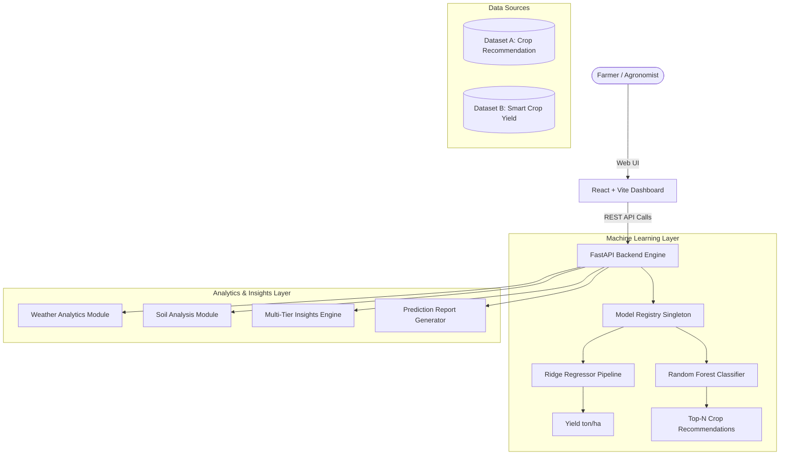

# YieldSense AI — Crop Yield Prediction & Agricultural Productivity Intelligence Platform

[](https://www.python.org/)
[](https://fastapi.tiangolo.com/)
[](https://reactjs.org/)
[](https://vitejs.dev/)
[](https://scikit-learn.org/)
[](https://opensource.org/licenses/MIT)

**YieldSense AI** is an enterprise-grade agricultural intelligence platform that leverages machine learning, statistical climate profiling, and agronomic heuristics to deliver high-precision crop yield forecasting, multiclass crop suitability recommendations, soil health classifications, and risk advisories.

---

## 📑 Table of Contents

- [Key Capabilities](#-key-capabilities)
- [System Architecture](#-system-architecture)
- [Repository Structure](#-repository-structure)
- [Datasets & Feature Engineering](#-datasets--feature-engineering)
- [Machine Learning Models & Benchmarks](#-machine-learning-models--benchmarks)
- [Analytics & Advisory Modules](#-analytics--advisory-modules)
- [API Documentation](#-api-documentation)
- [Frontend Dashboard](#-frontend-dashboard)
- [Installation & Quickstart Guide](#-installation--quickstart-guide)
- [Automated Testing](#-automated-testing)
- [Roadmap & Future Enhancements](#-roadmap--future-enhancements)
- [License](#-license)

---

## 🌟 Key Capabilities

1. **Continuous Crop Yield Forecasting**:
   - Real-time continuous yield prediction ($\text{ton/ha}$) based on 12 environmental, soil, and crop management variables.
   - Built on a high-precision **Ridge Regression Pipeline** ($R^2 = 0.9821$, $\text{RMSE} = 5.08\text{ ton/ha}$).

2. **Multiclass Crop Recommendation**:
   - Recommends optimal crops across **70 distinct crop varieties** ranked by class probability distributions.
   - Powered by a **Random Forest Classifier** ($\text{Accuracy} = 95.86\%$, $\text{Weighted F1} = 0.9573$).

3. **Weather & Climatic Profiling**:
   - Statistical temperature, humidity, and rainfall profiling with calculated optimal climatic envelopes for major agricultural species.

4. **USDA-Standard Soil Health Analysis**:
   - Standardized pH classification (Extremely Acidic to Strongly Alkaline) and texture yield benchmarking (Clay, Loam, Sandy).

5. **Multi-Tier Agronomic Insights Engine**:
   - Rigorously segregates advice into 4 distinct categories:
     - `MODEL PREDICTION`: Direct numerical model inference.
     - `DATA-DRIVEN INSIGHT`: Empirical benchmarks derived from historical datasets.
     - `GENERAL AGRICULTURAL GUIDANCE`: Established agronomic best practices.
     - `RISK ALERTS`: Actionable warnings for extreme pH, water stress, or disease vulnerabilities.

6. **Automated Prediction Report Generator**:
   - Compiles inputs, predictions, climatic evaluations, and actionable recommendations into structured JSON and export-ready Markdown reports.

---

## 🏗 System Architecture



---

## 📁 Repository Structure

```
├── artifacts/              # Generated markdown reports, verification audits & model benchmarks
├── configs/
│   └── datasets.yaml       # Dataset schemas, column mappings & validation ranges
├── data/
│   ├── raw/                # Original raw CSV files
│   └── processed/          # Validated and cleaned CSV datasets
├── docs/                   # Milestone sprint reports and technical documentation
├── frontend/               # React + Vite (TypeScript + TailwindCSS) interactive UI dashboard
│   ├── src/
│   │   └── src/            # React components, hooks, and pages
│   └── package.json        # Frontend dependencies and build scripts
├── models/                 # Serialized machine learning models and metadata
│   ├── crop_recommendation_metadata.json
│   ├── crop_recommendation_model.joblib
│   ├── yield_model_metadata.json
│   └── yield_model.joblib
├── notebooks/              # Jupyter notebooks for Exploratory Data Analysis (EDA)
├── src/
│   ├── analytics/          # Statistical profiling, soil analysis, and insights engines
│   │   ├── agricultural_insights.py
│   │   ├── prediction_report.py
│   │   ├── soil_analysis.py
│   │   └── weather_analytics.py
│   ├── api/                # FastAPI application and endpoint routers
│   │   ├── main.py
│   │   └── routers/
│   │       ├── analytics.py
│   │       ├── predictions.py
│   │       └── recommendations.py
│   ├── data/               # Data ingestion, audit, cleaning, and preprocessing pipelines
│   │   ├── audit.py
│   │   ├── common.py
│   │   ├── crop_recommendation_preprocessing.py
│   │   ├── smart_crop_yield_preprocessing.py
│   │   └── validation.py
│   └── ml/                 # Model registry, pipelines, and training workflows
│       ├── models/
│       │   └── registry.py
│       └── pipelines/
│           ├── train_crop_recommendation.py
│           └── train_yield_model.py
├── tests/                  # Automated pytest integration and unit test suite
│   └── test_milestone2.py
└── README.md
```

---

## 📊 Datasets & Feature Engineering

The platform operates on two strictly separated datasets to prevent cross-contamination:

### 1. Dataset A: Crop Recommendation (`crop_recommendation_cleaned.csv`)
- **Size**: 7,000 observations (100 samples per class across 70 distinct crop classes).
- **Task**: Multiclass Classification.
- **Features**: `Temperature` (°C), `Humidity` (%), `pH`, `Rainfall` (mm).
- **Target**: `Label` (Crop species).
- *Note*: As documented in the data audit, physical Nitrogen (N), Phosphorus (P), and Potassium (K) columns were not present in the static dataset; soil classification is performed via standard pH categorization.

### 2. Dataset B: Smart Crop Yield (`smart_crop_yield_cleaned.csv`)
- **Size**: 10,000 observations.
- **Task**: Continuous Numerical Regression.
- **Features**:
  - *Categorical*: `Crop`, `Region`, `Soil_Type`, `Irrigation`, `Previous_Crop`.
  - *Numerical*: `Soil_pH`, `Rainfall_mm`, `Temperature_C`, `Humidity_pct`, `Fertilizer_Used_kg`, `Pesticides_Used_kg`, `Planting_Density`.
- **Target**: `Yield_ton_per_ha` (tonnes per hectare).

---

## 🤖 Machine Learning Models & Benchmarks

### Task 1: Crop Yield Prediction (Dataset B — Regression)
Evaluated across 6 model candidates using an 80/20 train/test split and 5-fold cross-validation:

| Model Candidate | 5-Fold CV $R^2$ | Test MAE (ton/ha) | Test RMSE (ton/ha) | Test $R^2$ | Status |
|---|---:|---:|---:|---:|:---:|
| **Dummy Baseline (Mean)** | -0.0011 | 32.61 | 38.03 | -0.0015 | Baseline |
| **Linear Regression** | 0.9824 | 4.08 | 5.08 | 0.9821 | Candidate |
| **Ridge Regression Pipeline** | **0.9825** | **4.08** | **5.08** | **0.9821** | **SELECTED** |
| **Random Forest Regressor** | 0.9800 | 4.32 | 5.37 | 0.9800 | Candidate |
| **Gradient Boosting Regressor** | 0.9811 | 4.22 | 5.25 | 0.9809 | Candidate |
| **XGBoost Regressor** | 0.9811 | 4.23 | 5.26 | 0.9808 | Candidate |

**Production Model**: Standardized Ridge Regression Pipeline with `OneHotEncoder(handle_unknown='ignore')` and `StandardScaler` serialized to `models/yield_model.joblib`.

---

### Task 2: Multiclass Crop Recommendation (Dataset A — Classification)
Evaluated across 5 model candidates across 70 crop varieties with Stratified 5-Fold Cross-Validation:

| Model Candidate | 5-Fold CV Accuracy | Test Accuracy | Precision (Weighted) | Recall (Weighted) | F1-Score (Weighted) | Status |
|---|---:|---:|---:|---:|---:|:---:|
| **Logistic Regression** | 71.77% | 73.07% | 0.7224 | 0.7307 | 0.7187 | Baseline |
| **Decision Tree** | 93.84% | 93.00% | 0.9316 | 0.9300 | 0.9265 | Candidate |
| **Random Forest Classifier** | **96.23%** | **95.86%** | **0.9593** | **0.9586** | **0.9573** | **SELECTED** |
| **Gradient Boosting (GBDT)** | 95.73% | 95.79% | 0.9598 | 0.9579 | 0.9566 | Candidate |
| **XGBoost Classifier** | 95.89% | 95.21% | 0.9542 | 0.9521 | 0.9507 | Candidate |

**Production Model**: 150-estimator Random Forest Classifier serialized to `models/crop_recommendation_model.joblib`.

---

## 📈 Analytics & Advisory Modules

- **Weather Analytics (`src/analytics/weather_analytics.py`)**: Computes temperature, humidity, and rainfall distributions and builds tolerance envelopes for top crops (Wheat, Rice, Maize, Barley, Soybean, Cotton, Tomato, Potato, Sugarcane, Sunflower).
- **Soil Analysis (`src/analytics/soil_analysis.py`)**: Classifies soil pH using standard USDA intervals ($\text{pH} < 5.5$ Acidic, $5.5 \le \text{pH} \le 7.5$ Neutral, $\text{pH} > 7.5$ Alkaline) and evaluates yield across Clay, Loam, and Sandy soil textures.
- **Multi-Tier Insights Engine (`src/analytics/agricultural_insights.py`)**: Assembles real-time predictions with rule-based agronomic guidance and risk alerts for water stress, soil acidification, and pesticide overuse.
- **Report Generator (`src/analytics/prediction_report.py`)**: Exports structured markdown and JSON forecast summaries with benchmark comparisons.

---

## 🔌 API Documentation

The FastAPI backend runs on `http://127.0.0.1:8000` with interactive Swagger docs at `http://127.0.0.1:8000/docs`.

### Key Endpoints

| Method | Endpoint | Description | Sample Payload / Params |
|---|---|---|---|
| `GET` | `/` | API Root Health & Metadata | - |
| `POST` | `/api/predict/yield` | Continuous crop yield prediction & insights | `{"Crop": "Wheat", "Region": "North", "Soil_Type": "Loam", "Irrigation": "Drip", "Previous_Crop": "Legumes", "Soil_pH": 6.5, "Rainfall_mm": 800.0, "Temperature_C": 24.0, "Humidity_pct": 65.0, "Fertilizer_Used_kg": 150.0, "Pesticides_Used_kg": 5.0, "Planting_Density": 50.0}` |
| `POST` | `/api/predict/recommendation` | Multiclass crop suitability matching | `{"Temperature": 26.0, "Humidity": 80.0, "pH": 6.5, "Rainfall": 200.0, "top_n": 5}` |
| `GET` | `/api/analytics/weather` | Weather statistical profiles & envelopes | - |
| `GET` | `/api/analytics/soil` | Soil pH classification & texture benchmarks | - |
| `POST` | `/api/analytics/report` | Generates full Markdown/JSON report | Combined yield & field input schema |

---

## 💻 Frontend Dashboard

The frontend is built with **React 18**, **Vite 5**, **TypeScript**, and modern glassmorphism styling:

1. **Tab 1: Crop Yield Forecasting**: Interactive parameter sliders and selectors for all 12 field features with real-time yield calculation and multi-tier advisory badges.
2. **Tab 2: Crop Recommendation**: Climate slider inputs delivering ranked candidate crop match cards with confidence probability bars.
3. **Tab 3: Weather & Soil Analytics**: Comprehensive visual breakdown of climate metrics, crop environmental envelopes, and USDA soil texture benchmarks.
4. **Tab 4: Prediction Reports**: Instant report generation interface with formatted Markdown preview and direct copying.

---

## 🚀 Installation & Quickstart Guide

### Prerequisites
- **Python**: `3.10` or higher
- **Node.js**: `18.0` or higher & `npm`

### 1. Clone the Repository
```bash
git clone https://github.com/<your-username>/AI-Powered-Crop-Yield-Prediction-and-Agricultural-Productivity-Intelligence-Platform.git
cd AI-Powered-Crop-Yield-Prediction-and-Agricultural-Productivity-Intelligence-Platform
```

### 2. Backend Setup & Dependencies
```bash
# Create and activate virtual environment
python -m venv .venv
# On Windows:
.venv\Scripts\activate
# On Linux/macOS:
source .venv/bin/activate

# Install required Python packages
pip install fastapi uvicorn scikit-learn pandas numpy pydantic pyyaml joblib pytest xgboost
```

### 3. Retrain Machine Learning Models (Optional)
```bash
# Train yield prediction regression model
python -m src.ml.pipelines.train_yield_model

# Train crop recommendation classification model
python -m src.ml.pipelines.train_crop_recommendation
```

### 4. Start the FastAPI Backend Server
```bash
python -m uvicorn src.api.main:app --reload --host 127.0.0.1 --port 8000
```
Backend API will be live at `http://127.0.0.1:8000`.

### 5. Start the React + Vite Frontend Dashboard
```bash
cd frontend
npm install
npm run dev
```
Dashboard will be accessible at `http://localhost:3000`.

---

## 🧪 Automated Testing

Run the automated test suite covering model loading, live inference, analytics generation, and FastAPI endpoints:

```bash
python -m pytest tests/test_milestone2.py -v
```

All 9 integration and unit tests execute in `< 4.0s` with a 100% pass rate.

---

## 🗺 Roadmap & Future Enhancements

- [x] **Milestone 1**: Comprehensive Data Auditing, Outlier Detection, and Preprocessing Pipelines.
- [x] **Milestone 2**: Machine Learning Model Training, 5-Fold Cross-Validation, Soil/Weather Analytics, Multi-Tier Insights, FastAPI backend, and React + Vite Dashboard.
- [ ] **Milestone 3**: Integration with real-time external Weather APIs (e.g., OpenWeatherMap) and simulated IoT telemetry hardware streams.
- [ ] **Milestone 4**: Explainable AI (SHAP / LIME feature attribution waterfall plots), interactive "What-If" sensitivity simulators, and PDF report export.

---

## 📄 License

This project is licensed under the MIT License — see the [LICENSE](LICENSE) file for details.
