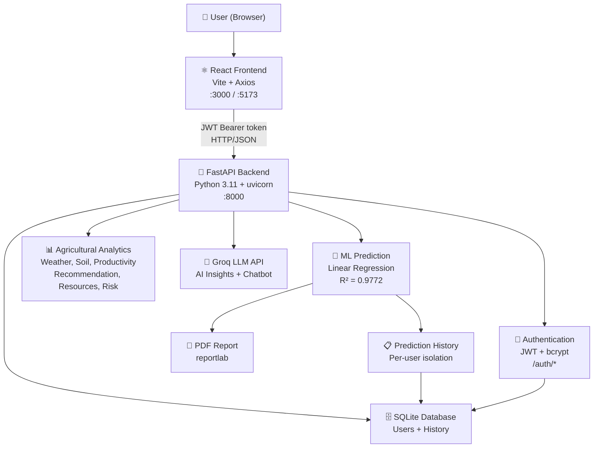
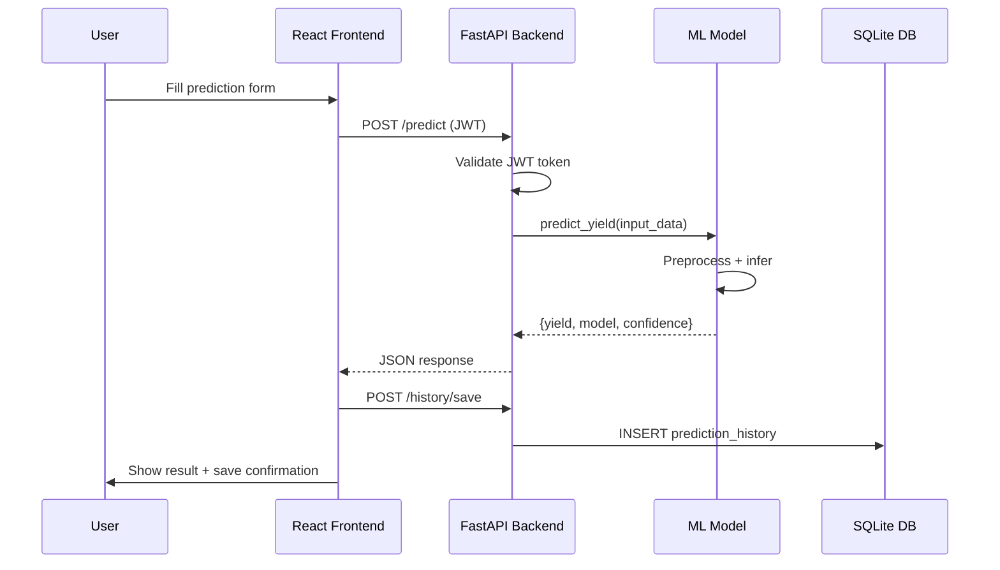
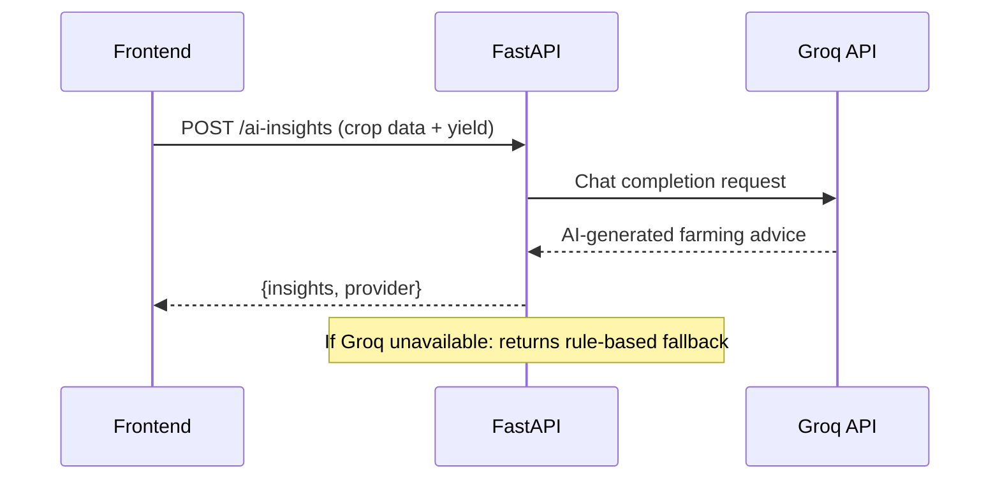
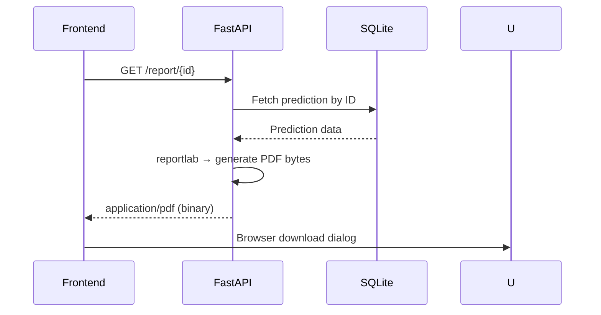
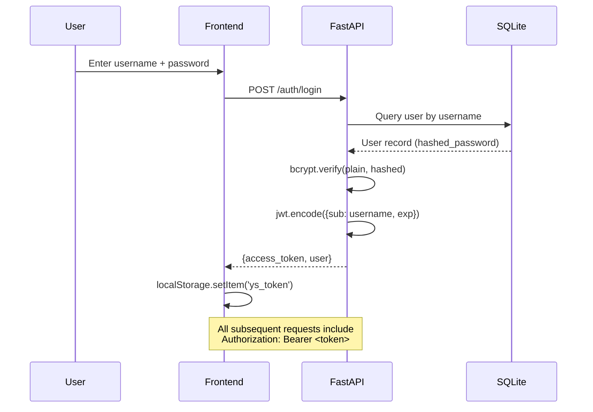
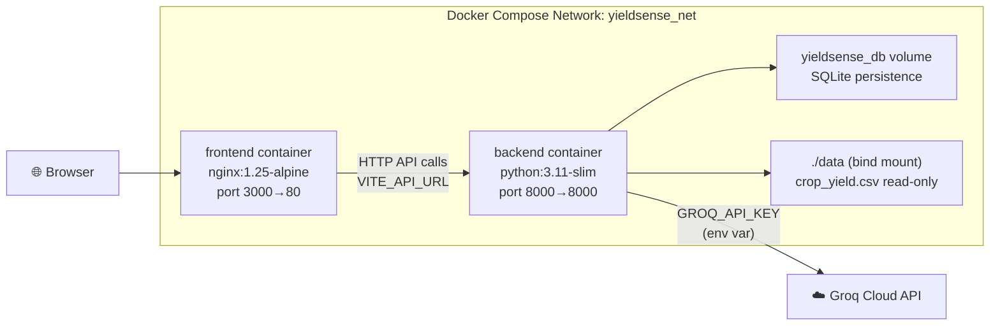

# YieldSense AI — System Architecture

## Overview

YieldSense AI is a full-stack agricultural intelligence platform combining a React frontend, FastAPI backend, SQLite database, scikit-learn ML model, and Groq LLM integration.

---

## High-Level Architecture



---

## Component Details

### Frontend — React (Vite)

| Item | Detail |
|---|---|
| Framework | React 18 + Vite 5 |
| HTTP Client | Axios with JWT interceptor |
| API Base | `import.meta.env.VITE_API_URL` (configurable) |
| Routing | React Router v6 |
| Charts | Recharts |
| Auth | JWT stored in localStorage |

**Pages:**
- `LoginPage`, `RegisterPage` — authentication
- `DashboardPage` — analytics overview, model comparison
- `PredictPage` — crop yield prediction form + AI insights
- `HistoryPage` — prediction history table
- `ChatbotPage` — Agriculture AI Assistant (Groq)
- `ProductivityPage` — condition-based yield analysis
- `RecommendationPage` — ML-based crop recommendation
- `ResourcesPage` — NPK and irrigation optimization
- `RiskPage` — agricultural risk assessment

---

### Backend — FastAPI

| Item | Detail |
|---|---|
| Framework | FastAPI 0.111 |
| Server | uvicorn (ASGI) |
| Auth | JWT (python-jose) + bcrypt password hashing |
| ORM | SQLAlchemy 2.0 |
| Validation | Pydantic v2 |
| Config | pydantic-settings + `.env` |

**API Routes:**

| Router | Prefix | Description |
|---|---|---|
| auth | `/auth` | Register, Login, /me |
| predict | `/predict` | Crop yield prediction |
| insights | `/ai-insights` | Groq AI farming insights |
| weather | `/weather` | Weather-yield correlations |
| soil | `/soil` | Soil nutrient analysis |
| productivity | `/productivity` | Crop productivity analytics |
| recommendation | `/recommendation` | ML crop recommendation |
| resources | `/resources` | Resource optimization |
| risk | `/risk` | Agricultural risk assessment |
| history | `/history` | Prediction history CRUD |
| report | `/report` | PDF report generation |
| chatbot | `/chatbot` | Agriculture AI chatbot |

---

### Machine Learning — scikit-learn

| Item | Detail |
|---|---|
| Best Model | Linear Regression (`fit_intercept=False`) |
| R² Score | 0.9772 |
| MAE | 132.42 kg/acre |
| RMSE | 169.50 kg/acre |
| CV R² | 0.9800 ± 0.0022 |
| Dataset | 2,200 records, 80/20 split |
| Preprocessing | scikit-learn Pipeline (OHE + StandardScaler) |
| Selection | GridSearchCV across 5 models |

**Models compared:**

| Model | R² | MAE | RMSE |
|---|---|---|---|
| **Linear Regression** ✅ | **0.9772** | **132.42** | **169.50** |
| Gradient Boosting | 0.9753 | 139.93 | 176.58 |
| Random Forest | 0.9576 | 187.61 | 231.35 |
| Extra Trees | 0.9563 | 187.52 | 234.75 |
| Decision Tree | 0.9349 | 229.15 | 286.61 |

---

### Database — SQLite

**Tables:**

```
users
  id, username, email, full_name, hashed_password,
  role, farm_name, farm_location, is_active, created_at

prediction_history
  id, user_id, created_at,
  crop, region, rainfall_mm, temperature_c, weather_condition,
  soil_type, soil_ph, nitrogen, phosphorus, potassium,
  fertilizer_used, irrigation_used,
  predicted_yield_kg_per_acre, model_used, prediction_confidence
```

---

### AI Integration — Groq LLM

- **AI Insights** (`POST /ai-insights`): Sends crop parameters + predicted yield to Groq. Returns actionable farming recommendations. Gracefully falls back if key is missing.
- **Chatbot** (`POST /chatbot/ask`): Multi-turn agricultural Q&A. Maintains conversation history (last 10 messages). Falls back to a helpful static response if Groq is unavailable.

---

## Data Flow Diagrams

### Prediction Flow



### AI Insight Flow



### PDF Report Flow



### Authentication Flow



---

## Docker Architecture



---

## Security Design

| Concern | Implementation |
|---|---|
| Passwords | bcrypt hash (never stored plain) |
| Sessions | Stateless JWT (HS256, 60 min expiry) |
| Secrets | `.env` file (gitignored) — never hardcoded |
| API keys | Server-side only (`GROQ_API_KEY`) |
| User isolation | All history queries filter by `user_id` |
| Input validation | Pydantic v2 schemas on all endpoints |
| CORS | Explicit allowed origins list |
