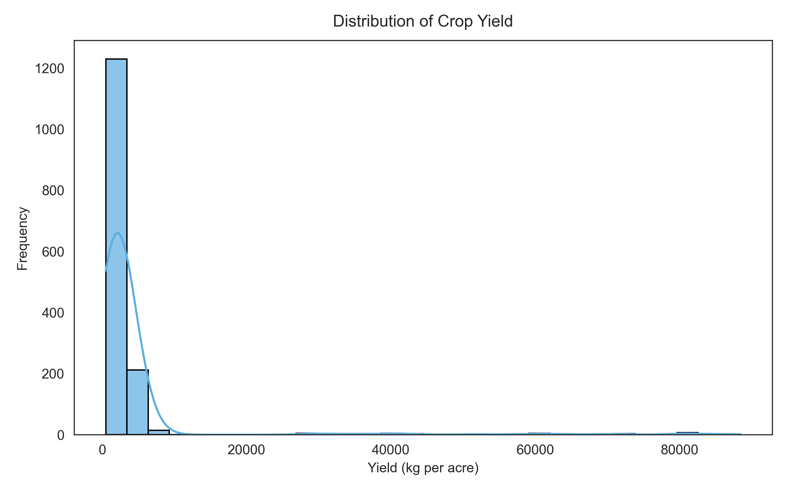
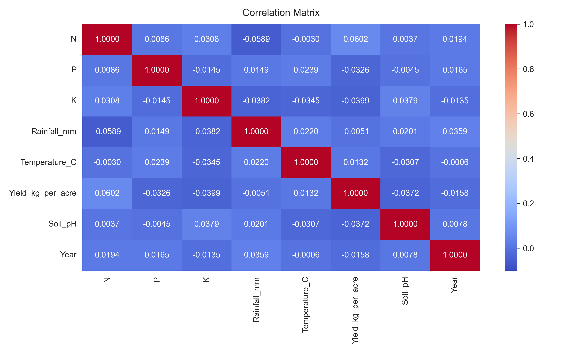

# AI AgriYield Predictor

## Milestone 1 Documentation
### Requirements & Dataset Preparation

---

### Title
**AI-Based Crop Yield Prediction Using Soil and Weather Parameters.**

---

### Project Objective
The objective of this project is to develop a machine learning model to predict crop yield (kg per acre) using soil nutrients, weather conditions, fertilizer usage, and weather-related features.

Since the target variable (`Yield_kg_per_acre`) is a continuous numerical value, this problem is treated as a **regression problem**.

---

### Data Source
The dataset was provided by the project mentor as part of the **Infosys Springboard Virtual Internship**.

**Dataset details:**
- **Total records:** 1500
- **Total columns:** 12
- **Categorical features:** `State`, `Crop`, `Soil_Type`, `Fertilizer`
- **Numerical features:** `N`, `P`, `K`, `Rainfall_mm`, `Temperature_C`, `Soil_pH`, `Year`
- **Target variable:** `Yield_kg_per_acre`

---

### Process Followed

#### Step 1: Environment Setup
- Created a virtual environment.
- Installed required libraries (`pandas`, `numpy`, `seaborn`, `matplotlib`, `scikit-learn`).
- Used Jupyter Notebook for implementation.

#### Step 2: Data Exploration

The dataset was loaded using:
```python
df = pd.read_csv("dataset.csv")
df.head()
```

| # | State | Crop | Soil_Type | Fertilizer | N | P | K | Rainfall_mm | Temperature_C | Yield_kg_per_acre | Soil_pH | Year |
|---|---|---|---|---|---|---|---|---|---|---|---|---|
| **0** | Karnataka | Soybean | Loamy | DAP | 56 | 41 | 51 | 120 | 31.06 | 1839 | 6.82 | 2003 |
| **1** | Odisha | Cotton | Red Soil | Urea | 29 | 36 | 112 | 247 | 33.97 | 1062 | 6.41 | 2002 |
| **2** | Punjab | Groundnut | Red Soil | Compost | 37 | 38 | 177 | 142 | 24.21 | 1463 | 7.06 | 2015 |
| **3** | Gujarat | Wheat | Red Soil | Compost | 58 | 77 | 129 | 227 | 30.85 | 2373 | 5.93 | 2022 |
| **4** | Andhra Pradesh | Cotton | Clay | Organic | 108 | 61 | 63 | 263 | 37.03 | 1497 | 6.24 | 2017 |

```python
df.info()
```

```text
<class 'pandas.DataFrame'>
RangeIndex: 1500 entries, 0 to 1499
Data columns (total 12 columns):
 #   Column              Non-Null Count  Dtype  
---  ------              --------------  -----  
 0   State               1500 non-null   str    
 1   Crop                1500 non-null   str    
 2   Soil_Type           1500 non-null   str    
 3   Fertilizer          1500 non-null   str    
 4   N                   1500 non-null   int64  
 5   P                   1500 non-null   int64  
 6   K                   1500 non-null   int64  
 7   Rainfall_mm         1500 non-null   int64  
 8   Temperature_C       1500 non-null   float64
 9   Yield_kg_per_acre   1500 non-null   int64  
 10  Soil_pH             1500 non-null   float64
 11  Year                1500 non-null   int64  
dtypes: float64(2), int64(6), str(4)
memory usage: 140.8 KB
```

```python
df.describe()
```

| | N | P | K | Rainfall_mm | Temperature_C | Yield_kg_per_acre | Soil_pH | Year |
|---|---|---|---|---|---|---|---|---|
| **count** | 1500.000000 | 1500.000000 | 1500.000000 | 1500.000000 | 1500.000000 | 1500.000000 | 1500.000000 | 1500.000000 |
| **mean** | 73.435000 | 61.282000 | 102.115000 | 176.609000 | 28.148547 | 7881.852667 | 6.799247 | 2012.090000 |
| **std** | 37.750002 | 33.257422 | 54.952863 | 75.776182 | 5.783168 | 20673.333805 | 0.724098 | 7.293218 |
| **min** | 10.000000 | 5.000000 | 10.000000 | 50.000000 | 18.020000 | 502.000000 | 5.500000 | 2000.000000 |
| **25%** | 41.000000 | 32.000000 | 56.000000 | 113.000000 | 23.132500 | 1202.750000 | 6.120000 | 2005.000000 |
| **50%** | 70.000000 | 61.000000 | 100.000000 | 175.000000 | 28.450000 | 1673.500000 | 6.795000 | 2012.000000 |
| **75%** | 106.000000 | 91.000000 | 149.000000 | 242.000000 | 33.180000 | 2571.750000 | 7.400000 | 2019.000000 |
| **max** | 139.000000 | 119.000000 | 199.000000 | 299.000000 | 37.960000 | 89946.000000 | 8.000000 | 2024.000000 |

**Observations:**
- Dataset contains 1500 rows and 12 columns.
- No missing values were found.
- Data types were appropriate for processing.
- Yield variable showed slight skewness due to some high maximum values.

#### Step 3: Data Cleaning

Missing values were checked using:
```python
df.isnull().sum()
```

Duplicate rows were checked using:
```python
duplicates = df.duplicated().sum()
```

**Results:**
- No missing values
- No duplicate records

*Thus, no additional cleaning was required.*

---

### Data Analysis (Graphs)

#### Graph 1: Distribution of Crop Yield
```python
plt.figure(figsize=(8,5))
sns.histplot(df['Yield_kg_per_acre'], bins=30, kde=True)
plt.title("Distribution of Crop Yield")
plt.xlabel("Yield (kg per acre)")
plt.ylabel("Frequency")
plt.show()
```



**Observation:**
- The yield distribution is slightly right-skewed.
- Some crops have significantly higher yield values compared to the majority.
- Most yield values fall within a moderate range.

#### Graph 2: Correlation Heatmap
```python
plt.figure(figsize=(10,6))
sns.heatmap(df.corr(numeric_only=True), annot=True, cmap='coolwarm')
plt.title("Correlation Matrix")
plt.show()
```



**Observation:**
- The heatmap shows relationships between numerical features.
- Some soil nutrients and rainfall show correlation with yield.
- Helps in understanding which features may influence crop productivity.

---

### Feature Engineering

#### One-Hot Encoding
Since machine learning models cannot process categorical text data directly, categorical features were converted using one-hot encoding:

```python
X = df.drop("Yield_kg_per_acre", axis=1)
y = df["Yield_kg_per_acre"]
X_encoded = pd.get_dummies(X, drop_first=True)
```

The dataset was split into features ($X$) and target variable ($y$) before applying encoding.

**Result:**
- Number of features increased from 12 to 39.
- All categorical variables were converted into numerical format.

#### Feature Scaling
Numerical features had different ranges (e.g., rainfall in hundreds, pH in single digits). To ensure uniform scaling of numerical features, `StandardScaler` was applied only to the following columns:

```python
scaler = StandardScaler()
numerical_cols = ['N', 'P', 'K', 'Rainfall_mm', 'Temperature_C', 'Soil_pH', 'Year']
X_encoded[numerical_cols] = scaler.fit_transform(X_encoded[numerical_cols])
print("Final dataset shape after preprocessing:", X_encoded.shape)
```

**After scaling:**
- Numerical features were standardized ($\text{mean} = 0, \text{std} = 1$).
- Dataset shape became **(1500, 39)**.
- No rows were lost during preprocessing.

---

### Challenges Faced
1. Initial virtual environment activation issues.
2. Execution delay due to kernel configuration.
3. Understanding the correct order of preprocessing steps.

*These were resolved through proper environment setup and debugging.*

---

### Outcome of Milestone 1
- Dataset was explored and understood.
- No missing or duplicate data.
- Categorical features were encoded.
- Numerical features were standardized.
- 2 important visualizations were generated.
- Final dataset prepared for regression model training.

---

### Conclusion
Milestone 1 successfully completed dataset preparation and preprocessing steps required for machine learning. The data is now clean, structured, encoded, and scaled, making it ready for building regression models in the next milestone.

---

### Submitted by:
**Bandi Siri**  
`siribandi17@gmail.com`
