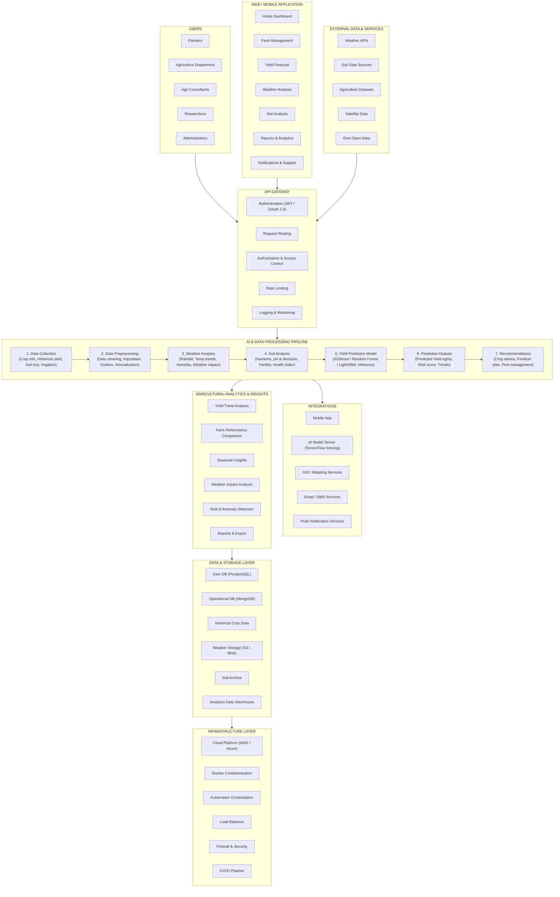

# YieldSense AI: Crop Yield Prediction & Agricultural Productivity Forecasting System

## 1. Title
**YieldSense AI: Crop Yield Prediction & Agricultural Productivity Forecasting System**

---

## 2. Objective
Build an AI-powered crop yield prediction platform that helps farmers and agricultural organizations estimate future crop production using historical farming data, weather conditions, and soil characteristics.

The system should support:
- Crop yield forecasting
- Weather analysis
- Soil analysis
- Productivity prediction
- Agricultural analytics through a centralized platform.

The platform is designed to improve farming decisions, optimize resource utilization, reduce uncertainty, and increase agricultural productivity using data-driven insights.

This solution can be used by:
- Farmers
- Agricultural cooperatives
- Agribusiness companies
- Government agriculture departments
- Smart farming initiatives

### Key Outcomes
- Developed and deployed an AI-powered crop yield prediction and agricultural productivity forecasting platform.
- Implemented authentication and role-based access control systems.
- Built crop yield forecasting and production estimation workflows.
- Developed weather analysis and soil assessment modules.
- Implemented productivity prediction and agricultural recommendation systems.
- Built analytics dashboards for yield forecasting and seasonal performance monitoring.
- Developed AI-powered recommendation and risk assessment engines.
- Deployed the platform using Docker and cloud deployment platforms such as AWS or Azure.

---

## 3. Architecture Diagram

### Subsystem Layer Breakdown

1. **User Presentation & Interface Layer**:
   - Web/Mobile Portal serving Farmers, Agronomists, Consultants, and Admins with dashboards for Yield Forecasting, Weather Monitoring, and Soil Analysis.
2. **API Gateway Layer**:
   - Secures all REST endpoints with JWT / OAuth 2.0 authentication, request routing, rate limiting, and RBAC authorization.
3. **AI & Data Processing Pipeline Layer**:
   - **Step 1: Data Collection** -> **Step 2: Data Preprocessing** -> **Step 3: Weather Analysis** -> **Step 4: Soil Analysis** -> **Step 5: Yield Prediction Model (XGBoost / Random Forest / LightGBM)** -> **Step 6: Prediction Outputs (Yield kg/ha)** -> **Step 7: Recommendations (Crop & Fertilizer Advice)**.
4. **Integrations & External Services**:
   - External Weather APIs, Government Open Data, Satellite Remote Sensing, GIS Mapping, Email/SMS Push Notifications, and AI Model Serving (TensorFlow Serving / ONNX).
5. **Agricultural Analytics & Insights Layer**:
   - Multi-farm performance comparisons, risk and anomaly detection, seasonal trend forecasting, and interactive report exports.
6. **Data & Storage Layer**:
   - Relational User DB (PostgreSQL), Operational NoSQL DB (MongoDB), Object Storage (AWS S3 / Azure Blob) for raw weather & soil archives, and Analytics Data Warehouse.
7. **Infrastructure & DevOps Layer**:
   - Cloud hosting (AWS / Azure), Docker containerization, Kubernetes orchestration, Load balancing, and automated CI/CD deployment pipelines.

---

## 4. Modules to be Implemented

### Module 1: User Management Module
- Farmer registration and login
- Profile management
- Farm information management
- Role-based access control (Farmer, Agronomist, Admin)

### Module 2: Data Collection Module
- Crop data management
- Weather data integration
- Soil information collection
- Historical farming records

#### Recommended Open-Source Agricultural Datasets
1. **FAOSTAT Crop Production Dataset** (Source: Food and Agriculture Organization)
   - *Data Includes*: Crop production statistics, harvested area, yield measurements, country and regional agricultural data.
   - *Use Cases*: Crop yield prediction, production trend analysis, seasonal forecasting.
2. **USDA Crop Yield and Agricultural Data** (Source: United States Department of Agriculture)
   - *Data Includes*: Historical crop yield records, crop acreage information, agricultural productivity metrics, regional farming statistics.
   - *Use Cases*: Yield forecasting model training, productivity analysis, comparative agricultural studies.
3. **Kaggle Crop Yield Prediction Dataset** (Source: Kaggle Open Datasets)
   - *Data Includes*: Crop information, rainfall records, temperature data, soil characteristics, historical yield measurements.
   - *Use Cases*: Machine learning model development, weather impact analysis, agricultural recommendation systems.

#### Dataset Usage in YieldSense AI
The platform combines:
- Historical crop yield datasets
- Weather datasets
- Soil datasets
to train machine learning models for:
- Crop yield forecasting
- Harvest estimation
- Productivity prediction
- Agricultural risk assessment
- Farming recommendation generation

### Module 3: Yield Prediction Module
- Crop yield forecasting
- Harvest estimation
- Production prediction
- AI model inference

### Module 4: Weather Analysis Module
- Rainfall analysis
- Temperature monitoring
- Climate trend analysis
- Weather impact assessment

### Module 5: Soil Analysis Module
- Soil quality evaluation
- Nutrient analysis
- Fertility assessment
- Soil suitability recommendations

### Module 6: Analytics Dashboard Module
- Yield prediction reports
- Productivity analytics
- Seasonal performance analysis
- Farm comparison reports

### Module 7: Recommendation Module
- Crop planning suggestions
- Farming recommendations
- Resource optimization advice
- Risk mitigation guidance

---

## 5. Week-wise Module Implementation and High-Level Requirements

### Milestone 1: Week 1 & 2 — Project Initialization, Design Process & Core Setup
- Define project objectives and agricultural forecasting workflows.
- Design system architecture and database schema.
- Create UI wireframes and workflow planning.
- Setup frontend and backend environments.
- Implement authentication and role-based access system.
- Collect agricultural datasets.
- Build data collection and preprocessing workflows.
- **Outcomes**: Understand AI applications in precision agriculture, learn system architecture and database design concepts, build frontend/backend project initialization, working authentication and data management system.

### Milestone 2: Week 3 & 4 — Yield Prediction & Agricultural Analysis
- Train machine learning forecasting models.
- Evaluate prediction accuracy and model performance.
- Generate crop yield prediction reports.
- Build weather analytics module.
- Develop soil analysis workflows.
- Generate agricultural insights and forecasting reports.
- **Outcomes**: Implement crop yield forecasting and analysis systems, build AI-powered prediction workflows, understand predictive analytics and agricultural forecasting concepts, generate real-time yield prediction insights.

### Milestone 3: Week 5 & 6 — Dashboard, Reporting & Recommendations
- Develop analytics dashboards.
- Generate productivity and seasonal reports.
- Build visualization components.
- Implement recommendation workflows.
- Generate farming suggestions and optimization advice.
- Develop risk assessment features.
- **Outcomes**: Build analytics and recommendation systems, implement reporting and visualization workflows, understand data-driven farming decision support concepts, complete end-to-end agricultural intelligence workflows.

### Milestone 4: Week 7 & 8 — Testing, Deployment & Documentation
- Validate prediction models and forecasting accuracy.
- Optimize system performance and dashboard responsiveness.
- Deploy platform using Docker and cloud environments.
- Prepare final project documentation and presentation.
- Demonstrate the complete YieldSense AI platform.
- **Outcomes**: Gain deployment and testing experience, improve prediction accuracy and platform usability, complete live deployment and final demonstration, prepare professional project documentation and presentation.

---

## 6. Evaluation Criteria

### Milestone 1 (Week 2)
- Project initialization and architecture setup completed.
- Authentication and data collection workflows implemented.
- Dataset preprocessing and management system functional.
- System design and UI planning completed.

### Milestone 2 (Week 4)
- Yield prediction and forecasting workflows implemented.
- Weather and soil analysis modules functional.
- Prediction reports generated successfully.
- Agricultural insights dashboard integrated.

### Milestone 3 (Week 6)
- Analytics dashboard and reporting system implemented.
- Recommendation engine functional.
- Productivity reports and visualizations generated.
- Risk assessment workflows integrated.

### Milestone 4 (Week 8)
- Fully deployed frontend and backend.
- Model testing and validation completed.
- Documentation and presentation prepared.
- Successful end-to-end platform demonstration completed.

---

## 7. Tools & Tech Stack

### Programming Language
- **Backend**: Python (FastAPI / Flask)
- **Frontend**: React.js / Next.js

### Database
- PostgreSQL
- MongoDB

### AI & Machine Learning
- Scikit-learn
- TensorFlow
- XGBoost
- Pandas
- NumPy

### Data Sources
- Weather APIs
- FAOSTAT Crop Production Dataset
- USDA Agricultural Data
- Kaggle Crop Yield Prediction Dataset
- Soil Analysis Data

### Cloud & DevOps
- Docker
- AWS / Azure

### Libraries & Frameworks
- FastAPI / Flask
- React.js / Next.js
- Tailwind CSS / Glassmorphism CSS
- JWT Authentication
- TensorFlow / XGBoost
- Chart.js / Recharts

### Dev & Deployment Tools
- **IDE**: VS Code
- **Version Control**: Git + GitHub
- **Containerization**: Docker & Docker Compose
- **Deployment**: AWS / Azure
- **API Testing**: Postman
- **Monitoring**: Optional Logging & Monitoring Tools

---

## 8. Performance Metrics

### AI Model Performance
- Prediction accuracy
- Mean Absolute Error (MAE)
- Root Mean Square Error (RMSE)
- Model inference time

### Agricultural Performance
- Yield estimation accuracy
- Weather impact prediction accuracy
- Recommendation effectiveness

### System Performance
- Dashboard response time
- Data processing speed
- API latency

---

## 9. Example Quantitative Goals

### Crop Yield Prediction
- Achieve accurate crop yield forecasting and harvest estimation.

### Weather & Soil Analysis
- Generate reliable weather impact and soil suitability assessments.

### Agricultural Recommendations
- Provide data-driven farming recommendations and risk mitigation strategies.

### Platform Performance
- Support large-scale agricultural forecasting and analytics with stable system performance.
