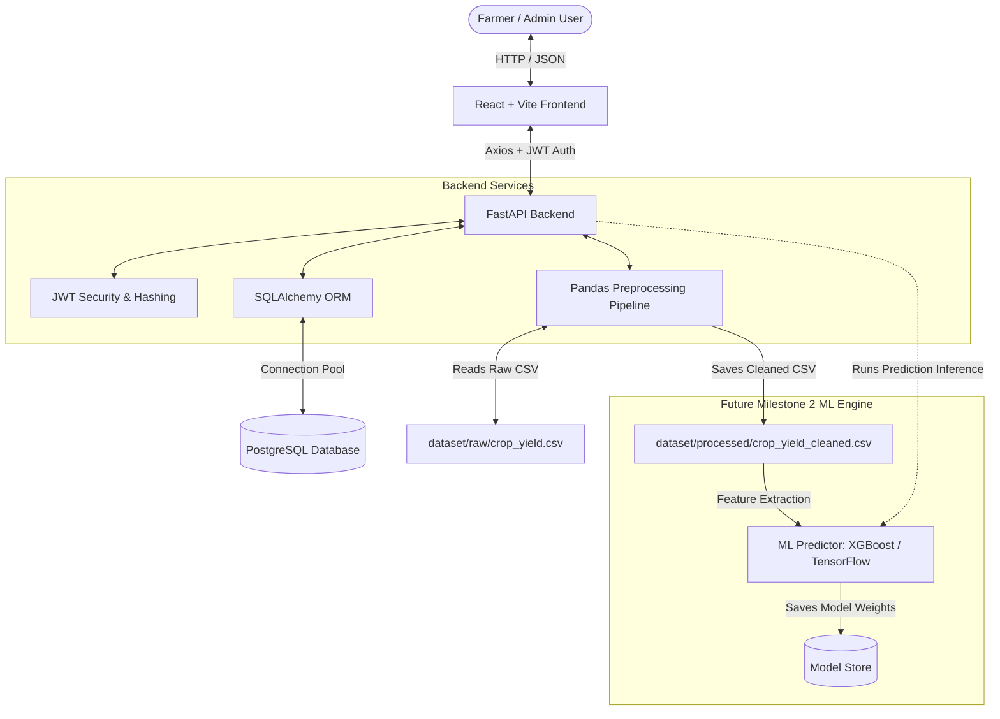

# System Architecture - YieldSense AI

This document details the system design and service interactions for the **YieldSense AI** Agricultural Forecasting Platform.

## 1. Architectural Diagram

Below is the layout of how components communicate, from the client interface down to raw and processed data layers.

---

## 2. Core Service Components

### 2.1 React Frontend
- **Routing**: Client-side page navigation mapped via `react-router-dom`.
- **API Client**: Axios instance (`src/api.js`) featuring interceptor hooks to automatically inject the Bearer JWT token from localStorage.
- **Styling**: Tailwind CSS v3 for a responsive dashboard.
- **Role Constraints**: Hides/shows admin-only features.

### 2.2 FastAPI Backend
- **Endpoint Exporter**: Exposes Swagger-documented endpoints (`/api/health`, `/api/auth/*`, and CRUD for farms/crops).
- **CORS Middleware**: Allows cross-origin REST calls from Vite's local dev server.
- **Database Handler**: Managed session creation (`SessionLocal`) to prevent connections leak.

### 2.3 ORM & Database Layer
- **PostgreSQL**: Stores relational transactional entities (users, farms, crops, historical weather/soil records).
- **SQLAlchemy**: Decouples code from SQL syntax and models database tables as declarative objects with cascade deletion rules.

### 2.4 Preprocessing Layer
- **Pandas Pipeline**: Script-based ingestion service (`preprocessing.py`) to parse tabular datasets, log statistics, drop duplicates, and clamp physical anomalies (such as negative rainfall/yield values).

---

## 3. Future Milestone 2 Modules

Once the foundation is established, the following predictive features will be integrated:
1. **Yield Prediction Engine**: XGBoost and TensorFlow models trained on processed variables.
2. **Weather Analytics Integration**: Connecting to real-time external APIs (e.g. OpenWeatherMap) to fetch live forecasts.
3. **Soil Optimization Engine**: Recommendations on fertilizer and organic content modifications based on pH levels.
4. **Risk & Anomaly Alert Service**: Notification indicators flagging severe droughts, rainfall failures, or pest risks.
