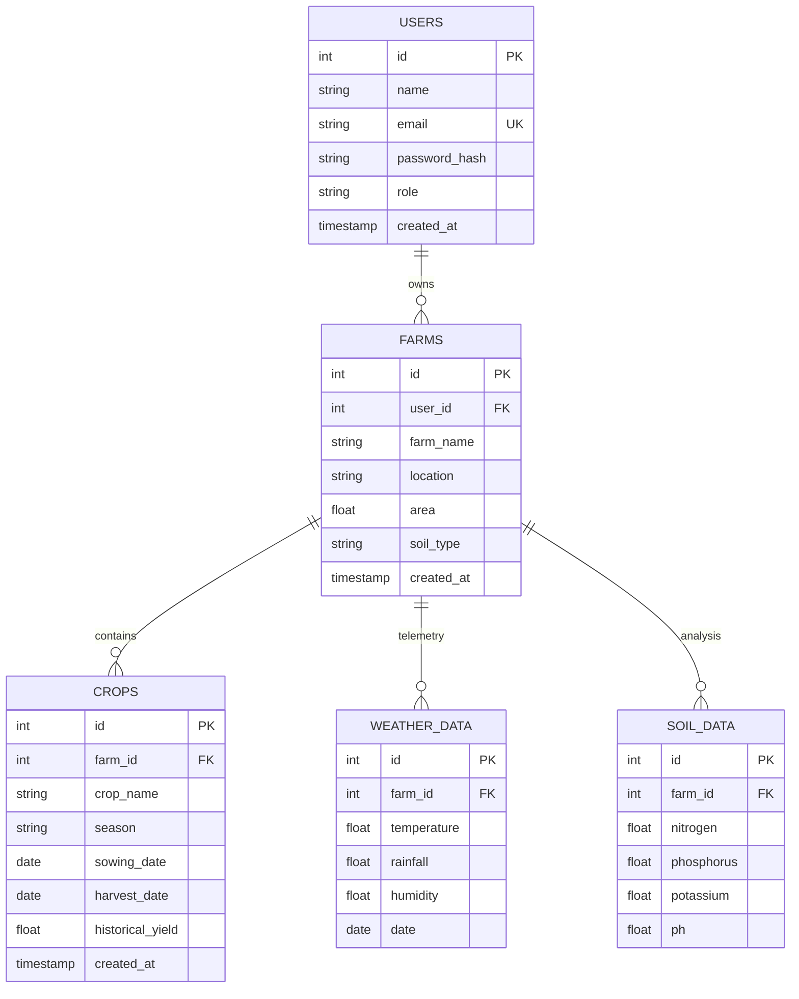

# Database Schema & Entity-Relationship Reference

This document covers the PostgreSQL relational model for **YieldSense AI**.

## 1. Entity-Relationship Schema

The database model tracks users, their farm assets, and associated telemetry/agricultural logs.

---

## 2. Table Specifications

### 2.1 Table: `users`
Tracks authorized accounts.
- `id` (Serial, Primary Key): Unique row identifier.
- `name` (VARCHAR(100), NOT NULL): Full name.
- `email` (VARCHAR(150), UNIQUE, INDEXED, NOT NULL): Account login identifier.
- `password_hash` (VARCHAR(255), NOT NULL): Secure hashed password (bcrypt).
- `role` (VARCHAR(50), NOT NULL): `"Farmer"` or `"Administrator"`.
- `created_at` (TIMESTAMP, DEFAULT NOW(), NOT NULL): Account creation date.

### 2.2 Table: `farms`
Fields registered to farmers.
- `id` (Serial, Primary Key): Unique row identifier.
- `user_id` (INT, FK, NOT NULL): Links to owning user (`users.id`). Cascade deletes on user removal.
- `farm_name` (VARCHAR(100), NOT NULL): Common name of the fields.
- `location` (VARCHAR(255), NOT NULL): Coordinates or region.
- `area` (FLOAT, NOT NULL): Size of field in acres (validated $> 0$).
- `soil_type` (VARCHAR(100), NOT NULL): Main soil profile.
- `created_at` (TIMESTAMP, DEFAULT NOW(), NOT NULL): Registration date.

### 2.3 Table: `crops`
Crops cultivated inside farm fields.
- `id` (Serial, Primary Key): Unique row identifier.
- `farm_id` (INT, FK, NOT NULL): Links to containing farm (`farms.id`). Cascade deletes.
- `crop_name` (VARCHAR(100), NOT NULL): Type of crop (e.g. Wheat, Rice).
- `season` (VARCHAR(50), NOT NULL): Sowing season (e.g. Kharif, Rabi).
- `sowing_date` (DATE, NULL): Date seeds were planted.
- `harvest_date` (DATE, NULL): Actual or planned harvest date.
- `historical_yield` (FLOAT, NULL): Harvest output in tons/acre (validated $\ge 0$).
- `created_at` (TIMESTAMP, DEFAULT NOW(), NOT NULL): Log entry timestamp.

### 2.4 Table: `weather_data`
WeatherData telemetry matching specific farms.
- `id` (Serial, Primary Key): Unique row identifier.
- `farm_id` (INT, FK, NOT NULL): Links to target farm. Cascade deletes.
- `temperature` (FLOAT, NOT NULL): Temperature in °C.
- `rainfall` (FLOAT, NOT NULL): Rainfall in mm.
- `humidity` (FLOAT, NOT NULL): Relative humidity percentage.
- `date` (DATE, NOT NULL): Telemetry record date.

### 2.5 Table: `soil_data`
Chemical soil metrics matching specific farms.
- `id` (Serial, Primary Key): Unique row identifier.
- `farm_id` (INT, FK, NOT NULL): Links to target farm. Cascade deletes.
- `nitrogen` (FLOAT, NOT NULL): Nitrogen (N) content in ppm.
- `phosphorus` (FLOAT, NOT NULL): Phosphorus (P) content in ppm.
- `potassium` (FLOAT, NOT NULL): Potassium (K) content in ppm.
- `ph` (FLOAT, NOT NULL): Soil pH level.
