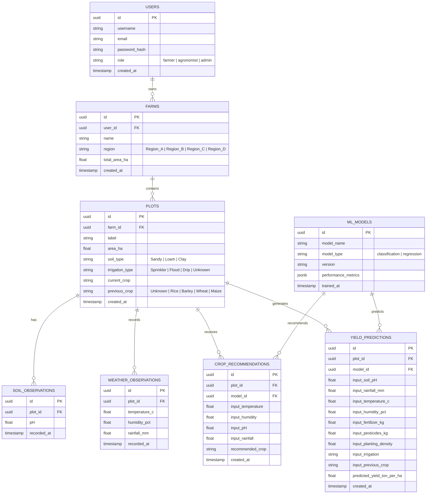

# Database Schema Design - YieldSense AI

This document defines the data models and database architecture for the **YieldSense AI** platform.

---

## Architectural Overview
YieldSense AI implements a **hybrid database architecture** to handle structured domain entities and high-throughput environmental logs:
1. **PostgreSQL (Relational)**: Relational operational database for User Management (RBAC), Farm/Plot configurations, Crop Recommendations, Yield Predictions, and Model Performance Metadata.
2. **MongoDB (NoSQL Document Store)**: Semi-structured storage for real-time IoT soil sensor feeds, telemetry, and live weather API responses.

---

## PostgreSQL Relational Schema

### Entity-Relationship Diagram (ERD)



---

### DDL Schema Specification (SQL)

```sql
-- Create custom enum types for consistency
CREATE TYPE user_role AS ENUM ('farmer', 'agronomist', 'admin');
CREATE TYPE region_type AS ENUM ('Region_A', 'Region_B', 'Region_C', 'Region_D');
CREATE TYPE soil_class AS ENUM ('Sandy', 'Loam', 'Clay');
CREATE TYPE irrigation_class AS ENUM ('Sprinkler', 'Flood', 'Drip', 'Unknown');
CREATE TYPE crop_class AS ENUM ('Rice', 'Barley', 'Wheat', 'Maize', 'Unknown');

-- 1. Users Table (Role-based access control)
CREATE TABLE users (
    id UUID PRIMARY KEY DEFAULT gen_random_uuid(),
    username VARCHAR(100) NOT NULL UNIQUE,
    email VARCHAR(255) NOT NULL UNIQUE,
    password_hash VARCHAR(255) NOT NULL,
    role user_role NOT NULL DEFAULT 'farmer',
    created_at TIMESTAMP WITH TIME ZONE DEFAULT CURRENT_TIMESTAMP
);

-- 2. Farms Table
CREATE TABLE farms (
    id UUID PRIMARY KEY DEFAULT gen_random_uuid(),
    user_id UUID NOT NULL REFERENCES users(id) ON DELETE CASCADE,
    name VARCHAR(150) NOT NULL,
    region region_type NOT NULL,
    total_area_ha NUMERIC(10, 2) NOT NULL CHECK (total_area_ha > 0),
    created_at TIMESTAMP WITH TIME ZONE DEFAULT CURRENT_TIMESTAMP
);

-- 3. Plots Table (Subdivisions inside a farm)
CREATE TABLE plots (
    id UUID PRIMARY KEY DEFAULT gen_random_uuid(),
    farm_id UUID NOT NULL REFERENCES farms(id) ON DELETE CASCADE,
    label VARCHAR(100) NOT NULL,
    area_ha NUMERIC(10, 2) NOT NULL CHECK (area_ha > 0),
    soil_type soil_class NOT NULL,
    irrigation_type irrigation_class NOT NULL DEFAULT 'Unknown',
    current_crop VARCHAR(100) NOT NULL,
    previous_crop crop_class NOT NULL DEFAULT 'Unknown',
    created_at TIMESTAMP WITH TIME ZONE DEFAULT CURRENT_TIMESTAMP
);

-- 4. Soil Observations Table
CREATE TABLE soil_observations (
    id UUID PRIMARY KEY DEFAULT gen_random_uuid(),
    plot_id UUID NOT NULL REFERENCES plots(id) ON DELETE CASCADE,
    pH NUMERIC(4, 2) NOT NULL CHECK (pH >= 0.0 AND pH <= 14.0),
    recorded_at TIMESTAMP WITH TIME ZONE DEFAULT CURRENT_TIMESTAMP
);

-- 5. Weather Observations Table
CREATE TABLE weather_observations (
    id UUID PRIMARY KEY DEFAULT gen_random_uuid(),
    plot_id UUID NOT NULL REFERENCES plots(id) ON DELETE CASCADE,
    temperature_c NUMERIC(5, 2) NOT NULL CHECK (temperature_c BETWEEN -10.00 AND 60.00),
    humidity_pct NUMERIC(5, 2) NOT NULL CHECK (humidity_pct BETWEEN 0.00 AND 100.00),
    rainfall_mm NUMERIC(7, 2) NOT NULL CHECK (rainfall_mm >= 0.00),
    recorded_at TIMESTAMP WITH TIME ZONE DEFAULT CURRENT_TIMESTAMP
);

-- 6. ML Models Metadata Table
CREATE TABLE ml_models (
    id UUID PRIMARY KEY DEFAULT gen_random_uuid(),
    model_name VARCHAR(150) NOT NULL,
    model_type VARCHAR(50) NOT NULL CHECK (model_type IN ('classification', 'regression')),
    version VARCHAR(30) NOT NULL UNIQUE,
    performance_metrics JSONB NOT NULL,
    trained_at TIMESTAMP WITH TIME ZONE DEFAULT CURRENT_TIMESTAMP
);

-- 7. Crop Recommendations Table
CREATE TABLE crop_recommendations (
    id UUID PRIMARY KEY DEFAULT gen_random_uuid(),
    plot_id UUID NOT NULL REFERENCES plots(id) ON DELETE CASCADE,
    model_id UUID NOT NULL REFERENCES ml_models(id),
    input_temperature NUMERIC(5, 2) NOT NULL,
    input_humidity NUMERIC(5, 2) NOT NULL,
    input_pH NUMERIC(4, 2) NOT NULL,
    input_rainfall NUMERIC(7, 2) NOT NULL,
    recommended_crop VARCHAR(100) NOT NULL,
    created_at TIMESTAMP WITH TIME ZONE DEFAULT CURRENT_TIMESTAMP
);

-- 8. Yield Predictions Table
CREATE TABLE yield_predictions (
    id UUID PRIMARY KEY DEFAULT gen_random_uuid(),
    plot_id UUID NOT NULL REFERENCES plots(id) ON DELETE CASCADE,
    model_id UUID NOT NULL REFERENCES ml_models(id),
    input_soil_pH NUMERIC(4, 2) NOT NULL,
    input_rainfall_mm NUMERIC(7, 2) NOT NULL,
    input_temperature_c NUMERIC(5, 2) NOT NULL,
    input_humidity_pct NUMERIC(5, 2) NOT NULL,
    input_fertilizer_kg NUMERIC(6, 2) NOT NULL,
    input_pesticides_kg NUMERIC(6, 2) NOT NULL,
    input_planting_density NUMERIC(4, 1) NOT NULL,
    input_irrigation irrigation_class NOT NULL,
    input_previous_crop crop_class NOT NULL,
    predicted_yield_ton_per_ha NUMERIC(7, 2) NOT NULL CHECK (predicted_yield_ton_per_ha >= 0),
    created_at TIMESTAMP WITH TIME ZONE DEFAULT CURRENT_TIMESTAMP
);

-- Create index structures for optimized queries
CREATE INDEX idx_farms_user ON farms(user_id);
CREATE INDEX idx_plots_farm ON plots(farm_id);
CREATE INDEX idx_soil_obs_plot_date ON soil_observations(plot_id, recorded_at DESC);
CREATE INDEX idx_weather_obs_plot_date ON weather_observations(plot_id, recorded_at DESC);
CREATE INDEX idx_recommendations_plot ON crop_recommendations(plot_id);
CREATE INDEX idx_predictions_plot ON yield_predictions(plot_id);
```

---

## MongoDB NoSQL Schema (Unstructured Telemetry / Sensor logs)

> [!IMPORTANT]
> **Future Architectural Component Notice**
> The MongoDB NoSQL telemetry store is proposed as a **future architectural component** for real-time sensor integration and weather feeds. It is **not** currently implemented or required for the Milestone 1 data foundation, which focuses on CSV/Excel ingestion.

### 1. IoT Sensor Telemetry Collection (`soil_sensors`)

> [!IMPORTANT]
> **Soil N/P/K Telemetry Note**
> The soil nutrient fields (`n_mg_kg`, `p_mg_kg`, `k_mg_kg`) in the schema below represent **future telemetry variables** to be collected from active soil probe sensors. 
> These fields:
> - Are **not** present in the current Kaggle training datasets (Dataset A or Dataset B).
> - Must not be treated as existing training features.
> - Do not impact current offline ML modeling.

```json
{
  "_id": "ObjectId('64ebd17d3d297a7e8b61c101')",
  "sensor_id": "sensor_soil_1092",
  "plot_id": "8b5f3964-b0db-4bfb-9276-f3ccb9ca9c1b",
  "timestamp": "2026-08-27T17:00:00Z",
  "telemetry": {
    "moisture_pct": 42.5,
    "temperature_c": 24.2,
    "pH": 6.35,
    "n_mg_kg": 120.4,
    "p_mg_kg": 45.2,
    "k_mg_kg": 210.8
  },
  "status": "active"
}
```

### 2. Weather API Aggregation (`weather_feed`)
```json
{
  "_id": "ObjectId('64ebd17d3d297a7e8b61c102')",
  "region": "Region_A",
  "retrieved_at": "2026-08-27T17:00:00Z",
  "source": "OpenWeatherMap",
  "current": {
    "temp": 28.5,
    "humidity": 62,
    "pressure": 1012,
    "wind_speed": 4.1
  },
  "hourly_forecast": [
    { "time": "18:00", "temp": 27.2, "precip_probability": 0.1 },
    { "time": "19:00", "temp": 25.8, "precip_probability": 0.4 }
  ],
  "raw_payload_dump": {
    "metadata": { "coord": { "lon": 78.48, "lat": 17.38 } }
  }
}
```
```
