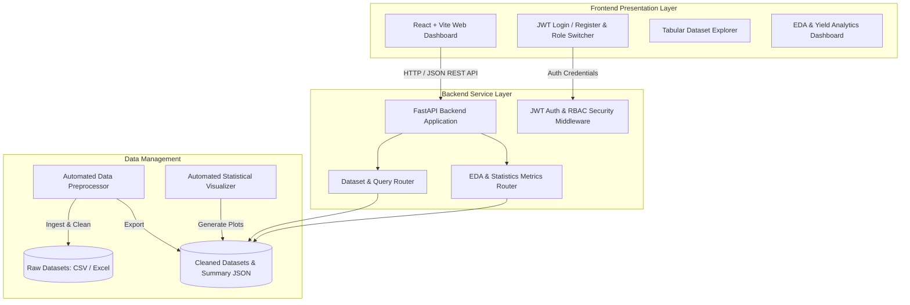

# YieldSense AI - System Architecture Document

## Overview
**YieldSense AI** is an AI-powered Crop Yield Prediction and Agricultural Productivity Forecasting Platform. The architecture is designed with modularity, scalability, and security to serve farmers, agricultural cooperatives, agribusinesses, and government agencies.

---

## High-Level Architecture Diagram

---

## Core Components

### 1. Data Collection & Processing Engine
- **Input Datasets**: `Smart_Farming_Crop_Yield_2024.csv` and `YieldSense_AI_Dataset_Collection.xlsx`.
- **Functions**: Data cleaning, null value imputation, date standardizations, crop duration computation, missing value detection, and statistical summarization.

### 2. Backend REST API (FastAPI)
- **Security**: JWT-based Bearer Token authentication with Role-Based Access Control (RBAC). Roles: `Admin`, `Farmer`, `Agronomist`.
- **Endpoints**:
  - `POST /api/auth/register` & `POST /api/auth/login`: User Authentication.
  - `GET /api/data/records`: Searchable, filterable crop yield data records.
  - `GET /api/data/summary`: Overview statistics (Total farms, average yield, rainfall averages).
  - `GET /api/data/eda`: Statistical distribution metrics and plot configurations.

### 3. Frontend Web Dashboard (React + Vite)
- **Theme**: Modern Dark / Glassmorphism Aesthetic.
- **Features**:
  - Role-based login and session persistence.
  - Live metric card statistics.
  - Searchable and paginated dataset explorer.
  - Interactive EDA chart visualizations (Yield distribution, Crop comparisons, Soil pH impact, Rainfall vs. Yield, Correlation heatmap).
