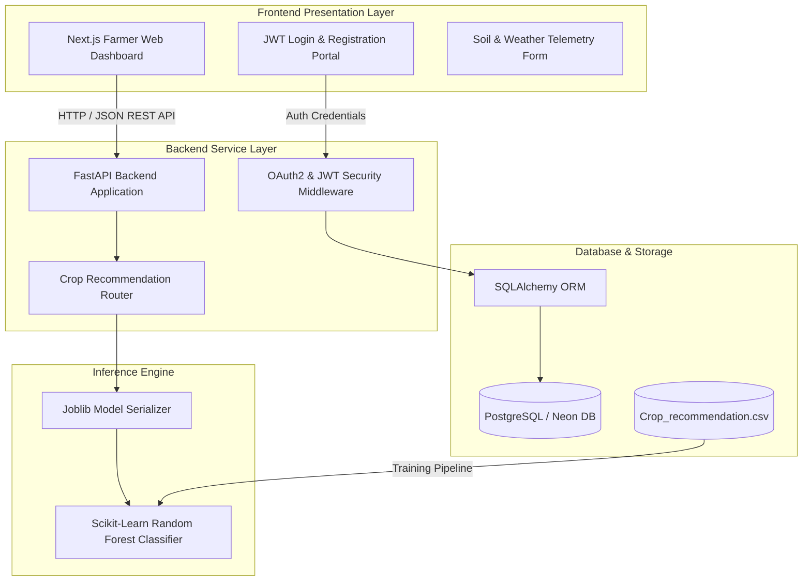

# YieldSense AI - System Architecture Document

## Overview

**YieldSense AI** is an AI-powered Crop Yield Prediction and Agricultural Productivity Forecasting Platform. The architecture is designed with modularity, scalability, and security to serve farmers, agricultural cooperatives, agribusinesses, and government agencies by providing real-time, data-driven crop recommendations.

---

## High-Level Architecture Diagram

---

## Core Components

### 1. Machine Learning & Inference Pipeline

* **Input Dataset**: `Crop_recommendation.csv` containing agricultural soil and climate telemetry.
* **Features**: Nitrogen (N), Phosphorus (P), Potassium (K), Temperature, Humidity, Soil pH, and Rainfall.
* **Model Engine**: Scikit-Learn `RandomForestClassifier` trained via an automated ingestion script (`train_model.py`) and serialized using `joblib` into `crop_recommendation_model.pkl`.

### 2. Backend REST API (FastAPI)

* **Security**: Stateless JSON Web Token (JWT) authentication using `OAuth2PasswordBearer` and `passlib` bcrypt password hashing.
* **Core Endpoints**:
* `POST /register`: New user onboarding and credential encryption.
* `POST /login`: Secure token generation for session authorization.
* `POST /predict`: Secure inference endpoint that ingests soil/weather metrics and outputs optimal crop recommendations.

* **Middleware**: Configured with CORS policy support for seamless cross-origin communication with the frontend client.

### 3. Frontend Web Dashboard (Next.js)

* **Framework**: Next.js (React) styled with Tailwind CSS.
* **Features**:
* Protected client-side routing and session persistence using `localStorage`.
* Interactive telemetry input form allowing farmers to fine-tune soil and weather conditions.
* Glassmorphic result panel rendering real-time AI recommendations.

### 4. Database & Persistence Layer

* **Database Management**: Relational PostgreSQL database (Neon DB).
* **ORM Integration**: SQLAlchemy models handling user registration profiles, roles (`farmer`), and secure credential verification.