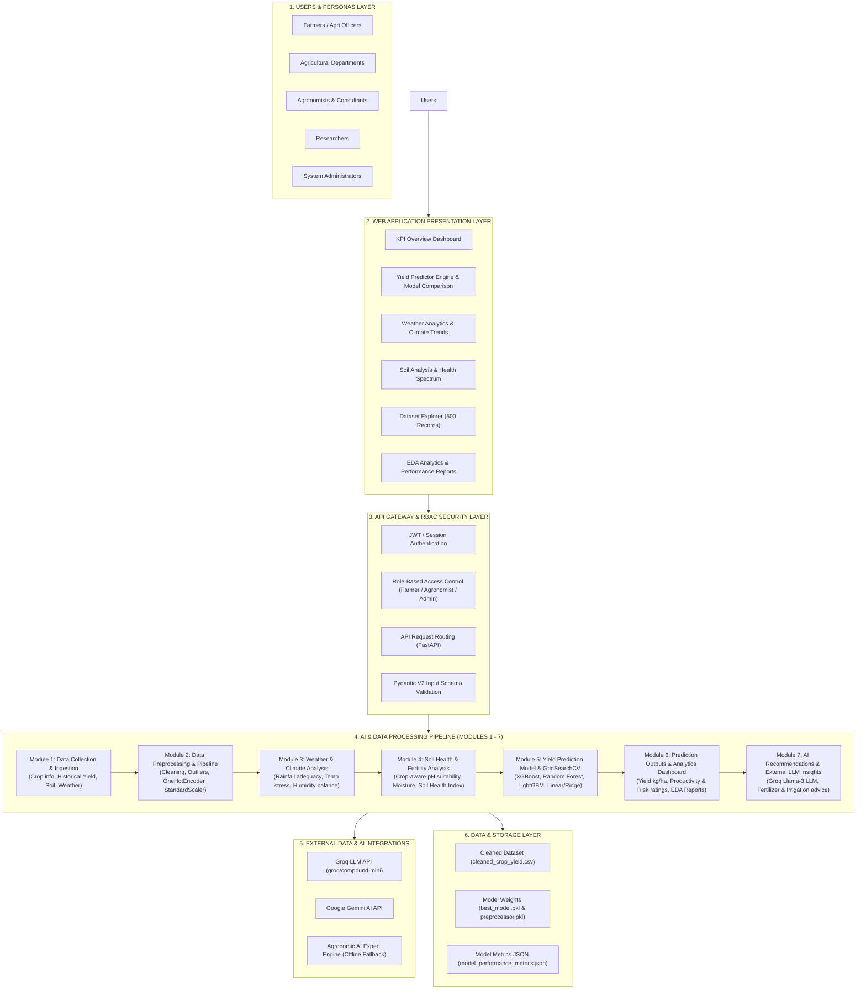

# YieldSense AI — Official Master Architecture & Module Specification

## 1. Executive System Overview
**YieldSense AI** is an enterprise-grade, AI-powered Crop Yield Prediction and Agricultural Productivity Intelligence Platform. 

The architecture is built on a **3-Tier Modular Framework** (Presentation Layer, API Gateway & Security Layer, AI Processing Pipeline, and Data/Storage Layer) fulfilling all requirements of Milestones 1, 2, 3, and 4.

---

## 2. Master System Architecture Diagram

---

## 3. Core Processing Modules & Deliverable Reference

### Security & User Management: User Authentication & Role-Based Access Control (RBAC)
- **Function**: Gate access and manage user credentials with 3 defined personas: **Farmer / Agri Officer**, **Agronomist**, and **System Administrator**.
- **Code Mapping**: `frontend/src/components/AuthModal.tsx`, `Header.tsx`, `App.tsx`.

### Module 1: Data Collection & Ingestion
- **Function**: Ingests agricultural telemetry, soil chemistry, weather conditions, and historical yield attributes across 500 farm records.
- **Code Mapping**: `datasets/raw/Smart_Farming_Crop_Yield_2024.csv`, `datasets/processed/cleaned_crop_yield.csv`, `frontend/src/components/DataExplorer.tsx`.

### Module 2: Data Preprocessing & Pipeline
- **Function**: Imputes missing values, cleans categorical strings, scales numerical features via `StandardScaler()`, and encodes categorical variables via `OneHotEncoder(handle_unknown='ignore')`.
- **Code Mapping**: `scripts/preprocess_data.py`, `models/preprocessor.pkl`.

### Module 3: Weather Analysis & Climate Trends
- **Function**: Computes regional rainfall adequacy scores, temperature stress risks, humidity balance, sunlight exposure, and seasonal rainfall vs. temperature trend lines.
- **Code Mapping**: `scripts/weather_analytics.py`, `backend/app/services/weather_service.py`, `backend/app/api/weather.py`, `frontend/src/components/WeatherAnalyticsView.tsx`.

### Module 4: Soil Analysis & Health Spectrum
- **Function**: Calculates crop-specific soil pH suitability (Rice: 5.5-6.8, Wheat: 6.0-7.5, Maize: 5.8-7.2, Soybean: 6.0-7.0, Cotton: 5.8-7.5), moisture sufficiency, NDVI index, and Soil Health Index (0.0-1.0).
- **Code Mapping**: `scripts/soil_analytics.py`, `backend/app/services/soil_service.py`, `backend/app/api/soil.py`, `frontend/src/components/SoilAnalysisView.tsx`.

### Module 5: Yield Prediction Model & GridSearchCV Training
- **Function**: Executes multi-model training and `GridSearchCV` hyperparameter tuning across 6 regression models (Linear Regression, Ridge, Random Forest, XGBoost, LightGBM, Dummy Mean Baseline), evaluating test RMSE/MAE/R²/Latency to save production model artifacts.
- **Code Mapping**: `scripts/train_models.py`, `models/best_model.pkl`, `models/model_performance_metrics.json`.

### Module 6: Prediction Outputs & Analytics Reporting Dashboard
- **Function**: Validates 14 input features via Pydantic V2, executes `ml_service.py` inference, calculates Productivity Ratings (`Low` <3500, `Medium` 3500-4800, `High` >4800) and renders interactive EDA statistical charts.
- **Code Mapping**: `backend/app/services/ml_service.py`, `backend/app/api/predictions.py`, `frontend/src/components/YieldPredictor.tsx`, `frontend/src/components/EdaDashboard.tsx`.

### Module 7: AI Recommendations & External LLM Insights
- **Function**: Integrates live **Groq LLM API** (`groq/compound-mini` / Llama-3 open source models) and Gemini AI to generate real-time AI yield summary insights, active crop risk flags, and step-by-step fertilizer/irrigation management advice.
- **Code Mapping**: `backend/app/services/llm_service.py`, `POST /api/predict/insights`, AI Insights Panel in `frontend/src/components/YieldPredictor.tsx`.

---

## 4. Development & Evaluation Directive
> **AUTHORITATIVE SPECIFICATION**: This Master System Architecture document serves as the official, updated specification for all project evaluations. All milestone deliverables (Milestones 1, 2, 3, and 4) map directly to the modules above.
