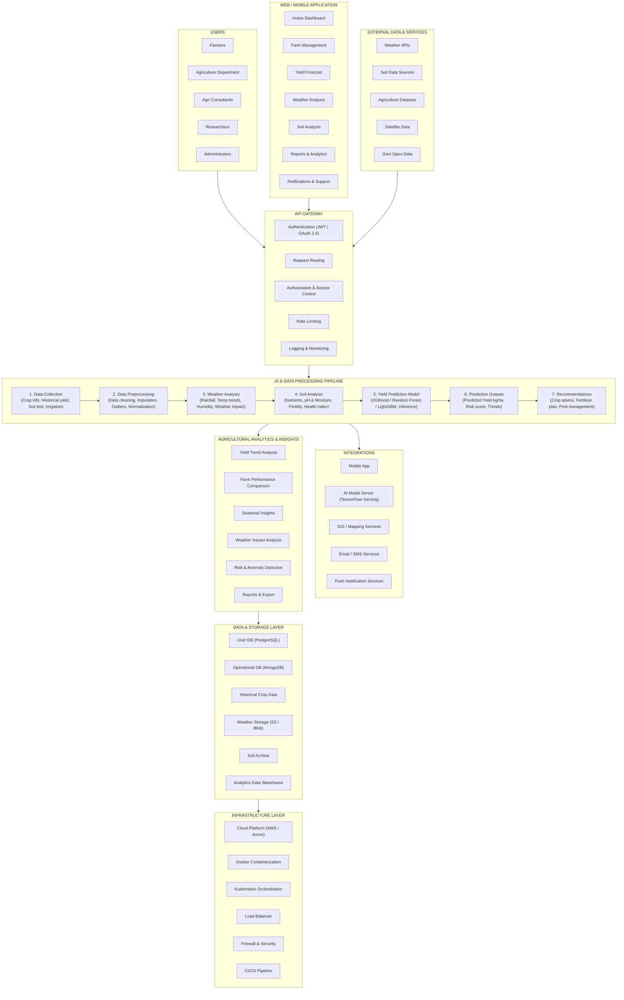

# YieldSense AI - System Architecture Document

## Overview
**YieldSense AI** is an AI-powered Crop Yield Prediction and Agricultural Productivity Forecasting Platform. The architecture is designed with modularity, scalability, and security to serve farmers, agricultural cooperatives, agribusinesses, and government agencies.

---

## High-Level Architecture Diagram

---

## Architectural Layer Breakdown

### 1. Presentation & User Experience Layer
- **Target Persona**: Farmers, Agricultural Officers, Agri Consultants, Researchers, and Administrators.
- **Portals**: Web and Mobile Application providing Home Dashboard, Farm Management, Yield Forecasting, Weather Monitoring, and Soil Analysis.

### 2. API Gateway & Security
- **Authentication**: JWT & OAuth 2.0 bearer token validation.
- **Routing**: Rate limiting, request routing, RBAC authorization, and centralized audit logging.

### 3. AI & Data Processing Pipeline
- **Sequential Pipeline**:
  $$\text{Data Collection} \rightarrow \text{Data Preprocessing} \rightarrow \text{Weather Analysis} \rightarrow \text{Soil Analysis} \rightarrow \text{Yield Prediction (XGBoost/RF)} \rightarrow \text{Prediction Outputs} \rightarrow \text{Recommendations}$$

### 4. Storage & Infrastructure Layer
- **Databases**: Relational User DB (PostgreSQL) + NoSQL Operational DB (MongoDB).
- **Object Storage**: AWS S3 / Azure Blob for satellite imagery, soil archives, and weather telemetry datasets.
- **DevOps**: Docker containers orchestrated via Kubernetes, protected by WAF firewalls, monitored via Prometheus & Grafana.
