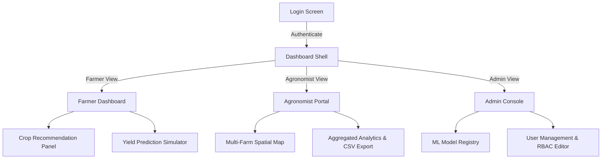

# User Interface Design & Layout Planning - YieldSense AI

This document details the UI planning, layout wireframes, and interaction workflows for the **YieldSense AI** platform.

---

## 1. Visual Aesthetics & Design System

YieldSense AI is designed with a premium, clean, and highly intuitive modern interface:
- **Typography**: Inter (primary sans-serif) for body text and labels; Outfit (display font) for statistics, headers, and dashboard summaries.
- **Color Palette (HSL Tailored)**:
  - *Sleek Dark Theme* (Primary Dashboard View):
    - Background: `hsl(220, 25%, 10%)` (Deep Slate Blue)
    - Surface Card: `hsl(220, 20%, 15% / 0.7)` (Translucent Glassmorphism)
    - Border / Ring: `hsl(220, 15%, 22%)` (Soft boundary line)
  - *Accent Indicators*:
    - Agricultural Green (Primary Actions): `hsl(142, 70%, 45%)` (Emerald)
    - Meteorological Blue (Weather metrics): `hsl(200, 85%, 55%)` (Sky Blue)
    - Warning Amber (Risk / Crop stress): `hsl(38, 92%, 50%)` (Gold)
- **Glassmorphism Styling**: All interactive dashboard widgets utilize glassmorphism panels featuring a light border-radius (`12px`), a subtle backdrop-filter blur (`16px`), and smooth box-shadow elevations.
- **Micro-Animations**: Hover actions feature transition durations of `200ms` with `cubic-bezier(0.4, 0, 0.2, 1)` scaling, and buttons expand slightly upon activation to improve tactile feedback.

---

## 2. Platform Navigation Flow



---

## 3. Wireframe & Dashboard Layouts

### A. Core Shell (Global sidebar navigation)
- **Left Panel (Sidebar)**: Fixed navigation pane with navigation links:
  - `[Dashboard]` (Dashboard summary cards)
  - `[Crop Recommendation]` (classification engine)
  - `[Yield Forecasting]` (regression simulator)
  - `[Historical Logs]` (relational PostgreSQL record logs)
  - `[Admin Settings]` (only visible to admin role)
- **Top Header**: User Profile context switcher (shows logged-in username and role: `Farmer`, `Agronomist`, or `Admin`) and a select dropdown for Farm/Plot selection.
- **Main Body**: Grid container with dynamic layout rendering based on active view.

---

### B. Farmer Dashboard Layout (Visual Wireframe)

```
+----------------------------------------------------------------------------------+
|  [Sidebar]  |  Header: Plot Selector [Plot #04 - Clay]      Profile: agro_user   |
|-------------+--------------------------------------------------------------------|
|  Dashboard  |  +--------------------+  +--------------------+  +--------------+  |
|  Crop Rec   |  | Temp: 24.9°C (Soft) |  | Humidity: 60.1%    |  | pH: 6.52     |  |
|  Yield Fore |  +--------------------+  +--------------------+  +--------------+  |
|  Logs       |                                                                    |
|             |  +--------------------------------------------------------------+  |
|  Logout     |  |  CROP RECOMMENDATION MODULE (Classification)                 |  |
|             |  |  Inputs: [pH: 6.5] [Temp: 22°C] [Hum: 80%] [Rainfall: 226mm]  |  |
|             |  |  [ RUN MATCHING ALGORITHM ]                                  |  |
|             |  |  Output: -> Recommended Crop: [ RICE ]  (Confidence: 87%)    |  |
|             |  +--------------------------------------------------------------+  |
|             |                                                                    |
|             |  +--------------------------------------------------------------+  |
|             |  |  YIELD PREDICTION SIMULATOR (Regression)                     |  |
|             |  |  Select Crop: [ Maize v ]  Density: [ 15.0 ]  Soil pH: [6.3] |  |
|             |  |  Fertilizer: [ 175 kg ]  Pesticide: [ 25 kg ]                |  |
|             |  |  Irrigation: [ Drip v ]  Prev Crop: [ Fallow v ]             |  |
|             |  |  [ RUN FORECASTER ] -> Predicted Yield: [ 128.4 ton/ha ]     |  |
|             |  +--------------------------------------------------------------+  |
+----------------------------------------------------------------------------------+
```

---

## 4. Role-Based Access Control (RBAC) User Views

1. **Farmer View**:
   - Access restricted to their allocated farm plots.
   - Can run Crop Recommendation queries based on local observations.
   - Can run Yield Simulations to plan fertilizer usage.
   - Can view historical recommendation and prediction logs for their farm.
2. **Agronomist View**:
   - Cross-farm access: Can view plots across multiple farms in the region.
   - Access to regional maps showing soil pH and rainfall distributions.
   - Can download bulk CSV prediction logs for analytical reports.
3. **Admin View**:
   - Access to user profile roles (can toggle user access levels).
   - Access to ML Model Registry showing active model versions (e.g. classification vs regression metrics).
   - Full read/write access across all schemas.
