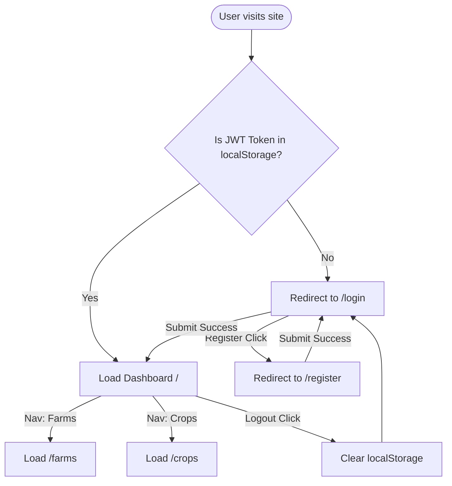

# Frontend UI Layout & Workflow Documentation

This document covers the UI/UX architecture and route navigation transitions for **YieldSense AI**.

## 1. Navigational Workflow Map

The React frontend handles authentication status and redirects users dynamically to ensure authorization.

---

## 2. Screen Specifications

### 2.1 Login / Sign In (`/login`)
- **Structure**: Clean card centered on the screen with a gradient background.
- **Interactions**:
  - Validates email format and password completion.
  - Sends a POST request to `/api/auth/login`.
  - On HTTP 200, stores `token`, `role`, and `name` in `localStorage` and routes the user to the dashboard `/`.
  - Shows clear error banners for wrong credentials or server connection failures.

### 2.2 Register (`/register`)
- **Structure**: Signup card similar to the login panel.
- **Interactions**:
  - Captures Full Name, Email, Password, and System Role ("Farmer" vs "Administrator").
  - Requires the password to be at least 6 characters.
  - Displays a green success banner and redirects back to `/login` after 2 seconds on success.

### 2.3 Dashboard (`/`)
- **Structure**: Responsive dashboard with:
  - Welcome greeting header showing the user's name and role badge.
  - Core statistics panel: Total Farms, Active Crops, Dataset Status, Preprocessing Status.
  - Machine Learning Forecast card clearly flagged as "Milestone 2 - Coming Soon".
  - Scope details card explaining Week 1 and Week 2 timelines.

### 2.4 Farm Management (`/farms`)
- **Structure**: Grid listing of all registered fields.
- **Interactions**:
  - Shows an empty-state illustration if no farms exist.
  - "Add Farm" button launches a modal with fields for Name, Location, Area Size, and Soil Type.
  - Automatically updates the dashboard card stats when a new farm is registered.

### 2.5 Crop Management (`/crops`)
- **Structure**: Relational crop log.
- **Interactions**:
  - Verifies if any farms exist first. If not, displays an alert directing the user to the Farms page first.
  - Lists crops in a table showing Crop Name, containing Farm Field, Growth Season, Sowing/Harvest Dates, and Historical Yield.
  - "Log Crop" button opens a modal linking the crop to one of the user's farms using a select dropdown.
